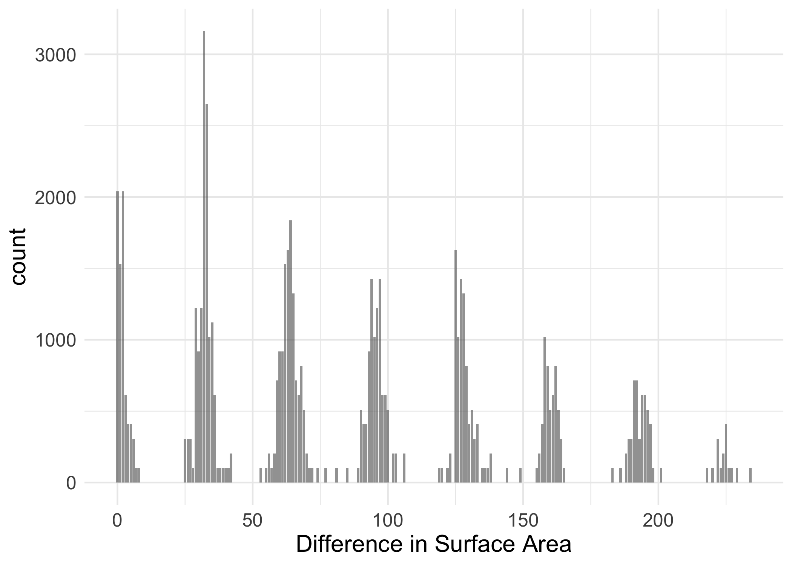
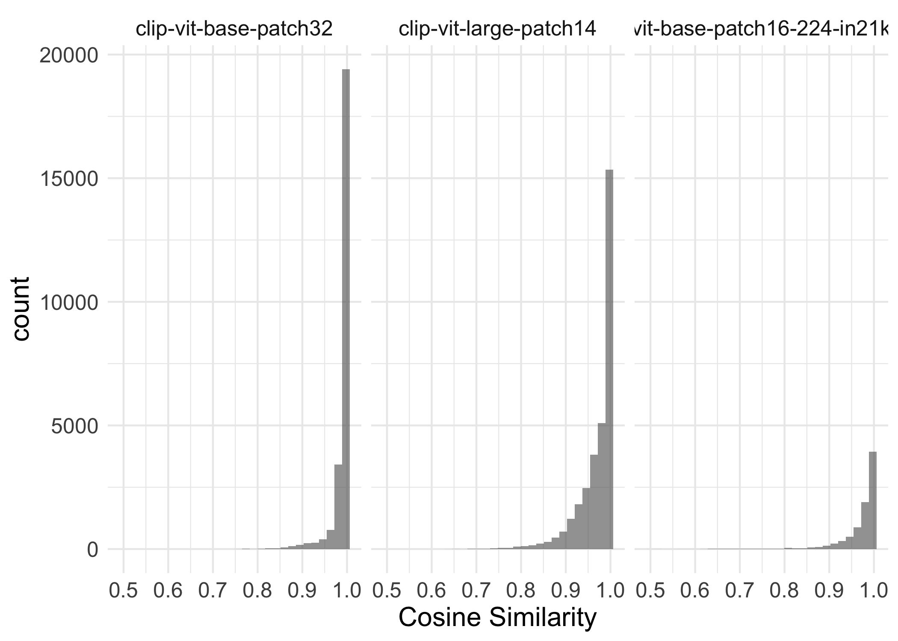
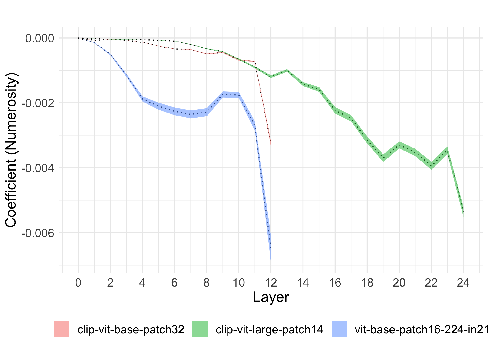
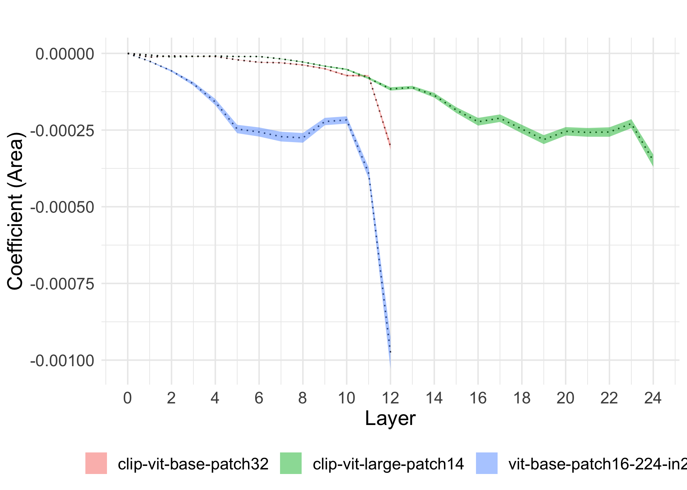
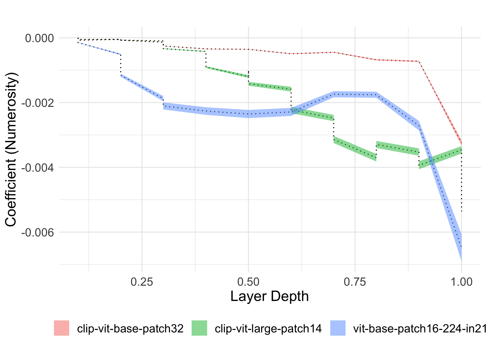
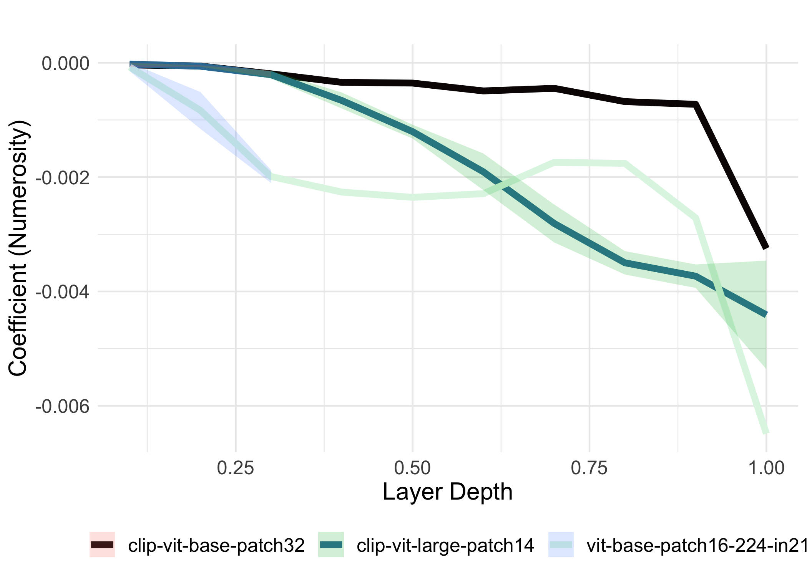

# Load data


```r
# setwd("/Users/seantrott/Dropbox/UCSD/Research/NLMs/vlm-vit-num/analysis")
directory_path <- "../results"
csv_files <- list.files(path = directory_path, pattern = "*.csv", full.names = TRUE)
csv_list <- csv_files %>%
  map(~ read_csv(.))
```

```
## New names:
## Rows: 8320 Columns: 13
## ── Column specification
## ──────────────────────────────────────────────────────── Delimiter: "," chr
## (5): model_name, image_type, image_1, image_2, numerosity_comparison_type dbl
## (8): ...1, cosine_similarity, numerosity_1, numerosity_2, area_diff, lay...
## ℹ Use `spec()` to retrieve the full column specification for this data. ℹ
## Specify the column types or set `show_col_types = FALSE` to quiet this message.
## New names:
## Rows: 24320 Columns: 13
## ── Column specification
## ──────────────────────────────────────────────────────── Delimiter: "," chr
## (5): model_name, image_type, image_1, image_2, numerosity_comparison_type dbl
## (8): ...1, cosine_similarity, numerosity_1, numerosity_2, area_diff, lay...
## ℹ Use `spec()` to retrieve the full column specification for this data. ℹ
## Specify the column types or set `show_col_types = FALSE` to quiet this message.
## New names:
## Rows: 32640 Columns: 13
## ── Column specification
## ──────────────────────────────────────────────────────── Delimiter: "," chr
## (5): model_name, image_type, image_1, image_2, numerosity_comparison_type dbl
## (8): ...1, cosine_similarity, numerosity_1, numerosity_2, area_diff, lay...
## ℹ Use `spec()` to retrieve the full column specification for this data. ℹ
## Specify the column types or set `show_col_types = FALSE` to quiet this message.
## • `` -> `...1`
```

```r
df_hf_models <- bind_rows(csv_list)


df_hf_models = df_hf_models %>%
  mutate(numerosity_diff = abs(numerosity_2 - numerosity_1)) %>%
  group_by(model_name) %>%
  mutate(max_layer = max(layer))


table(df_hf_models$model_name)
```

```
## 
##      clip-vit-base-patch32     clip-vit-large-patch14 
##                      24960                      32000 
## vit-base-patch16-224-in21k 
##                       8320
```


# Descriptive analyses


```r
df_hf_models %>%
  ggplot(aes(x = numerosity_diff)) +
  geom_bar(stat = "count", alpha = .6) +
  theme_minimal() +
  labs(x = "Difference in Numerosity") +
  theme(text = element_text(size = 15),
        legend.position = "bottom")
```

<!-- -->

```r
df_hf_models %>%
  ggplot(aes(x = area_diff)) +
  geom_bar(stat = "count", alpha = .6) +
  theme_minimal() +
  labs(x = "Difference in Surface Area") +
  theme(text = element_text(size = 15),
        legend.position = "bottom")
```

<!-- -->

```r
df_hf_models %>%
  ggplot(aes(x = cosine_similarity)) +
  geom_histogram(alpha = .6) +
  theme_minimal() +
  labs(x = "Cosine Similarity") +
  theme(text = element_text(size = 15)) +
  facet_wrap(~model_name)
```

```
## `stat_bin()` using `bins = 30`. Pick better value with `binwidth`.
```

<!-- -->

# Analyses

## Same Vs. Different Numerosity


```r
df_summary <- df_hf_models %>%
  mutate(area_diff_binned = ntile(area_diff, 4)) %>%
  group_by(model_name, numerosity_comparison_type, layer) %>%
  summarize(avg_similarity = mean(cosine_similarity, na.rm = TRUE),
            se_similarity = sd(cosine_similarity, na.rm = TRUE) / sqrt(n()))
```

```
## `summarise()` has grouped output by 'model_name', 'numerosity_comparison_type'.
## You can override using the `.groups` argument.
```

```r
df_summary %>%
  filter(layer == 12) %>%
  ggplot(aes(x = model_name,
             y = avg_similarity,
             fill = numerosity_comparison_type)) +
  geom_bar(stat = "identity", 
           position = position_dodge(width = 0.5),
           width = .6) +  
  geom_errorbar(aes(ymin = avg_similarity - se_similarity, 
                    ymax = avg_similarity + se_similarity), 
                width = 0.2,
                position = position_dodge(width = 0.5)) + 
  labs(# title = "",
       x = "Model",
       y = "Average Cosine Similarity",
       fill = "") +
  theme_minimal() +
  coord_flip() +
  scale_fill_viridis(option = "mako", discrete=TRUE) +
  theme(axis.title = element_text(size=rel(1.2)),
        axis.text = element_text(size = rel(1.2)),
        legend.text = element_text(size = rel(1.2)),
        # legend.title = element_text(size = rel(1.5)),
        strip.text.x = element_text(size = rel(1.2)),
        legend.position = "bottom")
```

<!-- -->

```r
m1 = lmer(data = df_hf_models,
          cosine_similarity ~ area_diff *layer + numerosity_comparison_type * layer + 
            (1 | image_1) + (1 | image_2) + (1 + numerosity_comparison_type|model_name))
```

```
## Warning in checkConv(attr(opt, "derivs"), opt$par, ctrl = control$checkConv, :
## Model failed to converge with max|grad| = 0.0475872 (tol = 0.002, component 1)
```

```r
summary(m1)
```

```
## Linear mixed model fit by REML. t-tests use Satterthwaite's method [
## lmerModLmerTest]
## Formula: cosine_similarity ~ area_diff * layer + numerosity_comparison_type *  
##     layer + (1 | image_1) + (1 | image_2) + (1 + numerosity_comparison_type |  
##     model_name)
##    Data: df_hf_models
## 
## REML criterion at convergence: -302588.9
## 
## Scaled residuals: 
##      Min       1Q   Median       3Q      Max 
## -15.4489  -0.3298   0.1555   0.5089   3.0384 
## 
## Random effects:
##  Groups     Name                           Variance  Std.Dev. Corr 
##  image_1    (Intercept)                    1.188e-04 0.010900      
##  image_2    (Intercept)                    8.973e-05 0.009473      
##  model_name (Intercept)                    2.946e-04 0.017163      
##             numerosity_comparison_typesame 7.174e-05 0.008470 -1.00
##  Residual                                  5.480e-04 0.023409      
## Number of obs: 65280, groups:  image_1, 480; image_2, 452; model_name, 3
## 
## Fixed effects:
##                                        Estimate Std. Error         df  t value
## (Intercept)                           1.010e+00  9.968e-03  2.047e+00  101.318
## area_diff                             1.465e-05  8.249e-06  7.264e+02    1.775
## layer                                -3.876e-03  3.016e-05  3.403e+04 -128.514
## numerosity_comparison_typesame       -4.372e-03  4.947e-03  2.083e+00   -0.884
## area_diff:layer                      -1.371e-05  2.361e-07  6.459e+04  -58.076
## layer:numerosity_comparison_typesame  1.985e-03  3.140e-05  1.070e+03   63.216
##                                      Pr(>|t|)    
## (Intercept)                          8.09e-05 ***
## area_diff                              0.0762 .  
## layer                                 < 2e-16 ***
## numerosity_comparison_typesame         0.4668    
## area_diff:layer                       < 2e-16 ***
## layer:numerosity_comparison_typesame  < 2e-16 ***
## ---
## Signif. codes:  0 '***' 0.001 '**' 0.01 '*' 0.05 '.' 0.1 ' ' 1
## 
## Correlation of Fixed Effects:
##             (Intr) ar_dff layer  nmrs__ ar_df:
## area_diff   -0.071                            
## layer       -0.026  0.170                     
## nmrsty_cmp_ -0.987 -0.004  0.027              
## are_dff:lyr  0.018 -0.256 -0.663  0.001       
## lyr:nmrst__  0.013  0.005 -0.516 -0.052 -0.018
## optimizer (nloptwrap) convergence code: 0 (OK)
## Model failed to converge with max|grad| = 0.0475872 (tol = 0.002, component 1)
```


## Continuous function of numerosity


```r
df_hf_models %>%
  filter(layer == max_layer) %>%
  ggplot(aes(x = numerosity_diff,
             y = cosine_similarity)) +
  geom_point(alpha = .5) +
  geom_smooth(method = "lm") +
  theme_minimal() +
  labs(# title = "",
       x = "Numerosity Difference",
       y = "Cosine Similarity",
       fill = "") +
  theme(text = element_text(size = 15),
        legend.position = "bottom") +
  facet_wrap(~model_name)
```

```
## `geom_smooth()` using formula = 'y ~ x'
```

<!-- -->

```r
### Run lm by layer
results <- df_hf_models %>%
  # mutate(numerosity_diff = scale(numerosity_diff),
  #       cosine_similarity = scale(cosine_similarity)) %>%
  dplyr::group_by(layer, model_name) %>%
  dplyr::summarise(
    model_summary = list(
      broom::tidy(lm(cosine_similarity ~ numerosity_diff + area_diff, data = dplyr::cur_data()))
    ),
    r_squared = summary(lm(cosine_similarity ~ numerosity_diff + area_diff, data = dplyr::cur_data()))$r.squared
  ) %>%
  dplyr::mutate(
    numerosity_diff_coef = purrr::map_dbl(model_summary, ~ .x %>% dplyr::filter(term == "numerosity_diff") %>% dplyr::pull(estimate)),
    numerosity_diff_se = purrr::map_dbl(model_summary, ~ .x %>% dplyr::filter(term == "numerosity_diff") %>% dplyr::pull(std.error)),
    area_diff_coef = purrr::map_dbl(model_summary, ~ .x %>% dplyr::filter(term == "area_diff") %>% dplyr::pull(estimate)),
    area_diff_se = purrr::map_dbl(model_summary, ~ .x %>% dplyr::filter(term == "area_diff") %>% dplyr::pull(std.error))
  ) %>%
  dplyr::select(layer, model_name, numerosity_diff_coef, numerosity_diff_se, area_diff_coef, area_diff_se, r_squared)
```

```
## Warning: There were 3 warnings in `dplyr::summarise()`.
## The first warning was:
## ℹ In argument: `model_summary = list(...)`.
## ℹ In group 1: `layer = 0`, `model_name = "clip-vit-base-patch32"`.
## Caused by warning:
## ! `cur_data()` was deprecated in dplyr 1.1.0.
## ℹ Please use `pick()` instead.
## ℹ Run `dplyr::last_dplyr_warnings()` to see the 2 remaining warnings.
```

```
## `summarise()` has grouped output by 'layer'. You can override using the
## `.groups` argument.
```

```r
results %>%
  ggplot(aes(x = layer, y = numerosity_diff_coef, fill = model_name)) +
  geom_line(linetype = "dotted") +  # Lineplot for mean entropy
  geom_ribbon(aes(ymin = numerosity_diff_coef - numerosity_diff_se, 
                  ymax = numerosity_diff_coef + numerosity_diff_se),
              alpha = 0.5,
              color = NA) +  # Shading for SE
  labs(
    title = "",
    x = "Layer",
    y = "Coefficient (Numerosity)",
    fill = "",
  ) +
  theme_minimal() +
  scale_x_continuous(limits = c(0, max(results$layer)),
                     breaks = seq(0, max(results$layer), 2)) +
  theme(text = element_text(size = 15),
        legend.position = "bottom") +
  scale_color_viridis(option = "mako", discrete=TRUE)
```

<!-- -->

```r
results %>%
  ggplot(aes(x = layer, y = area_diff_coef, fill = model_name)) +
  geom_line(linetype = "dotted") +  # Lineplot for mean entropy
  geom_ribbon(aes(ymin = area_diff_coef - area_diff_se, 
                  ymax = area_diff_coef + area_diff_se),
              alpha = 0.5,
              color = NA) +  # Shading for SE
  labs(
    title = "",
    x = "Layer",
    y = "Coefficient (Area)",
    fill = "",
  ) +
  theme_minimal() +
  scale_x_continuous(limits = c(0, max(results$layer)),
                     breaks = seq(0, max(results$layer), 2)) +
  theme(text = element_text(size = 15),
        legend.position = "bottom") +
  scale_color_viridis(option = "mako", discrete=TRUE)
```

<!-- -->

```r
m1 = lmer(data = df_hf_models,
          cosine_similarity ~ area_diff * layer + numerosity_diff *layer + 
            (1 | image_1) + (1 | image_2) + (1 | model_name))
```

```
## Warning in checkConv(attr(opt, "derivs"), opt$par, ctrl = control$checkConv, :
## Model failed to converge with max|grad| = 0.0020423 (tol = 0.002, component 1)
```

```r
summary(m1)
```

```
## Linear mixed model fit by REML. t-tests use Satterthwaite's method [
## lmerModLmerTest]
## Formula: cosine_similarity ~ area_diff * layer + numerosity_diff * layer +  
##     (1 | image_1) + (1 | image_2) + (1 | model_name)
##    Data: df_hf_models
## 
## REML criterion at convergence: -307971.2
## 
## Scaled residuals: 
##      Min       1Q   Median       3Q      Max 
## -16.2860  -0.3511   0.1401   0.5089   2.8484 
## 
## Random effects:
##  Groups     Name        Variance  Std.Dev.
##  image_1    (Intercept) 7.265e-05 0.008523
##  image_2    (Intercept) 5.405e-05 0.007352
##  model_name (Intercept) 1.676e-04 0.012947
##  Residual               5.065e-04 0.022506
## Number of obs: 65280, groups:  image_1, 480; image_2, 452; model_name, 3
## 
## Fixed effects:
##                         Estimate Std. Error         df  t value Pr(>|t|)    
## (Intercept)            1.005e+00  7.521e-03  2.046e+00  133.578 4.62e-05 ***
## area_diff              1.550e-05  6.645e-06  7.819e+02    2.332   0.0199 *  
## layer                 -1.869e-03  2.687e-05  6.459e+04  -69.543  < 2e-16 ***
## numerosity_diff        5.195e-04  4.442e-05  8.944e+02   11.695  < 2e-16 ***
## area_diff:layer       -1.380e-05  2.270e-07  6.458e+04  -60.809  < 2e-16 ***
## layer:numerosity_diff -1.832e-04  1.800e-06  6.458e+04 -101.773  < 2e-16 ***
## ---
## Signif. codes:  0 '***' 0.001 '**' 0.01 '*' 0.05 '.' 0.1 ' ' 1
## 
## Correlation of Fixed Effects:
##             (Intr) ar_dff layer  nmrst_ ar_df:
## area_diff   -0.077                            
## layer       -0.031  0.223                     
## numrsty_dff -0.031  0.018  0.138              
## are_dff:lyr  0.023 -0.305 -0.731 -0.006       
## lyr:nmrsty_  0.012 -0.005 -0.380 -0.362  0.017
## optimizer (nloptwrap) convergence code: 0 (OK)
## Model failed to converge with max|grad| = 0.0020423 (tol = 0.002, component 1)
```

```r
### Layer depth ratio

results %>%
  group_by(model_name) %>%
  mutate(max_layer = max(layer),
         prop_layer = layer / max_layer) %>%
  mutate(binned_prop_layer = ntile(prop_layer, 10)) %>%
  mutate(prop_binned = binned_prop_layer / 10) %>%
  ggplot(aes(x = prop_binned, y = numerosity_diff_coef, fill = model_name)) +
  geom_line(linetype = "dotted") +  # Lineplot for mean entropy
  geom_ribbon(aes(ymin = numerosity_diff_coef - numerosity_diff_se, 
                  ymax = numerosity_diff_coef + numerosity_diff_se),
              alpha = 0.5,
              color = NA) +  # Shading for SE
  labs(
    title = "",
    x = "Layer Depth",
    y = "Coefficient (Numerosity)",
    fill = "",
  ) +
  theme_minimal() +
  theme(text = element_text(size = 15),
        legend.position = "bottom") +
  scale_color_viridis(option = "mako", discrete=TRUE)
```

<!-- -->

```r
results %>%
  group_by(model_name) %>%
  mutate(max_layer = max(layer),
         prop_layer = layer / max_layer) %>%
  mutate(binned_prop_layer = ntile(prop_layer, 10)) %>%
  mutate(prop_binned = binned_prop_layer / 10) %>%
  ggplot(aes(x = prop_binned, y = numerosity_diff_coef)) +
  stat_summary(
    aes(group = model_name,
        color = model_name),  
    fun = mean,    
    geom = "line",        
    size = 2              
  ) +
  stat_summary(
    aes(group = model_name, 
        fill = model_name), 
    fun.data = mean_se,    
    geom = "ribbon",  
    alpha = 0.2,   
    color = NA     
  ) +
  theme_minimal() +
  labs(
    title = "",
    x = "Layer Depth",
    y = "Coefficient (Numerosity)",
    fill = "",
    color = "",
  ) +
  scale_color_viridis(option = "mako", discrete = TRUE) +
  theme(text = element_text(size = 15),
        legend.position = "bottom") 
```

```
## Warning: Using `size` aesthetic for lines was deprecated in ggplot2 3.4.0.
## ℹ Please use `linewidth` instead.
## This warning is displayed once every 8 hours.
## Call `lifecycle::last_lifecycle_warnings()` to see where this warning was
## generated.
```

<!-- -->


# VLM vs. ViT

## Same vs. Different


```r
df_hf_models = df_hf_models %>%
  mutate(model_type = case_when(
    str_detect(model_name, "clip") == TRUE ~ "VLM",
    TRUE ~ "ViT")) %>%
  group_by(model_name) %>%
  mutate(max_layer = max(layer))

df_summary <- df_hf_models %>%
  filter(layer == max_layer) %>%
  group_by(model_type, numerosity_comparison_type) %>%
  summarize(avg_similarity = mean(cosine_similarity, na.rm = TRUE),
            se_similarity = sd(cosine_similarity, na.rm = TRUE) / sqrt(n()))
```

```
## `summarise()` has grouped output by 'model_type'. You can override using the
## `.groups` argument.
```

```r
df_summary %>%
  ggplot(aes(x = factor(model_type),
             y = avg_similarity,
             color = numerosity_comparison_type)) +
  geom_point(position = position_dodge(width = 0.5), size = 2) +  
  geom_errorbar(aes(ymin = avg_similarity - 2 * se_similarity, 
                    ymax = avg_similarity + 2 * se_similarity), 
                width = 0.2,
                position = position_dodge(width = 0.5)) + 
  labs(# title = "",
       x = "Model Type",
       y = "Average Cosine Similarity",
       color = "") +
  theme_minimal() +
  scale_color_viridis(option = "mako", discrete=TRUE) +
  theme(axis.title = element_text(size=rel(1.2)),
        axis.text = element_text(size = rel(1.2)),
        legend.text = element_text(size = rel(1.2)),
        # legend.title = element_text(size = rel(1.5)),
        strip.text.x = element_text(size = rel(1.2)),
        legend.position = "bottom")
```

<!-- -->

```r
m1 = lmer(data = filter(df_hf_models, layer == max_layer),
          cosine_similarity ~ area_diff * model_type + numerosity_comparison_type * model_type + 
            (1 | image_1) + (1 | image_2) + (1 | model_name))

summary(m1)
```

```
## Linear mixed model fit by REML. t-tests use Satterthwaite's method [
## lmerModLmerTest]
## Formula: 
## cosine_similarity ~ area_diff * model_type + numerosity_comparison_type *  
##     model_type + (1 | image_1) + (1 | image_2) + (1 | model_name)
##    Data: filter(df_hf_models, layer == max_layer)
## 
## REML criterion at convergence: -13704.5
## 
## Scaled residuals: 
##     Min      1Q  Median      3Q     Max 
## -6.0206 -0.3721  0.0161  0.4847  3.9337 
## 
## Random effects:
##  Groups     Name        Variance  Std.Dev.
##  image_1    (Intercept) 0.0013206 0.03634 
##  image_2    (Intercept) 0.0009146 0.03024 
##  model_name (Intercept) 0.0006441 0.02538 
##  Residual               0.0010780 0.03283 
## Number of obs: 3840, groups:  image_1, 480; image_2, 452; model_name, 3
## 
## Fixed effects:
##                                                Estimate Std. Error         df
## (Intercept)                                   9.167e-01  2.574e-02  1.056e+00
## area_diff                                    -9.625e-04  3.410e-05  1.394e+03
## model_typeVLM                                 3.622e-03  3.121e-02  1.015e+00
## numerosity_comparison_typesame                6.497e-02  3.458e-03  2.203e+03
## area_diff:model_typeVLM                       6.546e-04  2.363e-05  3.121e+03
## model_typeVLM:numerosity_comparison_typesame -2.962e-02  2.844e-03  3.121e+03
##                                              t value Pr(>|t|)    
## (Intercept)                                   35.613   0.0148 *  
## area_diff                                    -28.220   <2e-16 ***
## model_typeVLM                                  0.116   0.9263    
## numerosity_comparison_typesame                18.787   <2e-16 ***
## area_diff:model_typeVLM                       27.698   <2e-16 ***
## model_typeVLM:numerosity_comparison_typesame -10.415   <2e-16 ***
## ---
## Signif. codes:  0 '***' 0.001 '**' 0.01 '*' 0.05 '.' 0.1 ' ' 1
## 
## Correlation of Fixed Effects:
##             (Intr) ar_dff md_VLM nmrs__ a_:_VL
## area_diff   -0.113                            
## modl_typVLM -0.810  0.037                     
## nmrsty_cmp_ -0.068 -0.026  0.030              
## ar_dff:_VLM  0.065 -0.577 -0.064  0.013       
## mdl_tVLM:__  0.045  0.011 -0.044 -0.685 -0.020
```

## Continuous


```r
df_hf_models %>%
  filter(layer == max_layer) %>%
  ggplot(aes(x = numerosity_diff,
             y = cosine_similarity,
             color = model_type)) +
  geom_point(alpha = .5) +
  geom_smooth(method = "lm") +
  theme_minimal() +
  labs(x = "Numerosity Difference",
       y = "Cosine Similarity",
       color = "") +
  scale_color_viridis(option = "mako", discrete=TRUE) +
  theme(text = element_text(size = 15),
        legend.position = "bottom") +
  facet_wrap(~model_type)
```

```
## `geom_smooth()` using formula = 'y ~ x'
```

<!-- -->

```r
m1 = lmer(data = filter(df_hf_models, layer == max_layer),
          cosine_similarity ~ area_diff * model_type + numerosity_diff * model_type + 
            (1 | image_1) + (1 | image_2) + (1 | model_name))

summary(m1)
```

```
## Linear mixed model fit by REML. t-tests use Satterthwaite's method [
## lmerModLmerTest]
## Formula: cosine_similarity ~ area_diff * model_type + numerosity_diff *  
##     model_type + (1 | image_1) + (1 | image_2) + (1 | model_name)
##    Data: filter(df_hf_models, layer == max_layer)
## 
## REML criterion at convergence: -14074.6
## 
## Scaled residuals: 
##     Min      1Q  Median      3Q     Max 
## -5.7464 -0.3629  0.0264  0.4708  4.1530 
## 
## Random effects:
##  Groups     Name        Variance  Std.Dev.
##  image_1    (Intercept) 0.0007275 0.02697 
##  image_2    (Intercept) 0.0005041 0.02245 
##  model_name (Intercept) 0.0006442 0.02538 
##  Residual               0.0010601 0.03256 
## Number of obs: 3840, groups:  image_1, 480; image_2, 452; model_name, 3
## 
## Fixed effects:
##                                 Estimate Std. Error         df t value Pr(>|t|)
## (Intercept)                    9.831e-01  2.562e-02  1.036e+00  38.372   0.0146
## area_diff                     -9.616e-04  2.934e-05  1.922e+03 -32.773   <2e-16
## model_typeVLM                 -2.438e-02  3.120e-02  1.013e+00  -0.781   0.5764
## numerosity_diff               -6.235e-03  2.145e-04  2.562e+03 -29.068   <2e-16
## area_diff:model_typeVLM        6.548e-04  2.344e-05  3.133e+03  27.940   <2e-16
## model_typeVLM:numerosity_diff  2.395e-03  1.859e-04  3.133e+03  12.884   <2e-16
##                                  
## (Intercept)                   *  
## area_diff                     ***
## model_typeVLM                    
## numerosity_diff               ***
## area_diff:model_typeVLM       ***
## model_typeVLM:numerosity_diff ***
## ---
## Signif. codes:  0 '***' 0.001 '**' 0.01 '*' 0.05 '.' 0.1 ' ' 1
## 
## Correlation of Fixed Effects:
##             (Intr) ar_dff md_VLM nmrst_ a_:_VL
## area_diff   -0.100                            
## modl_typVLM -0.813  0.043                     
## numrsty_dff -0.046  0.019  0.024              
## ar_dff:_VLM  0.066 -0.666 -0.065 -0.012       
## mdl_tyVLM:_  0.034 -0.011 -0.034 -0.722  0.017
```


