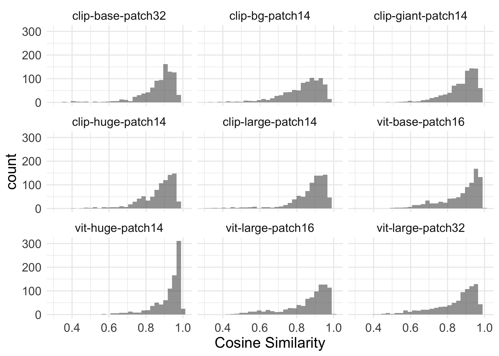
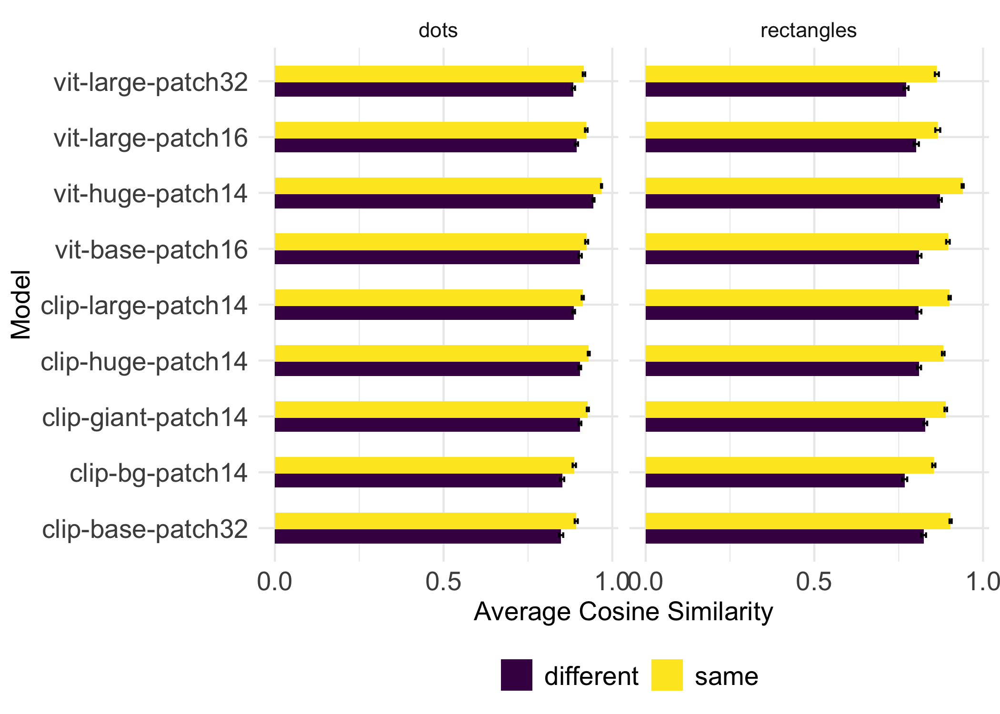
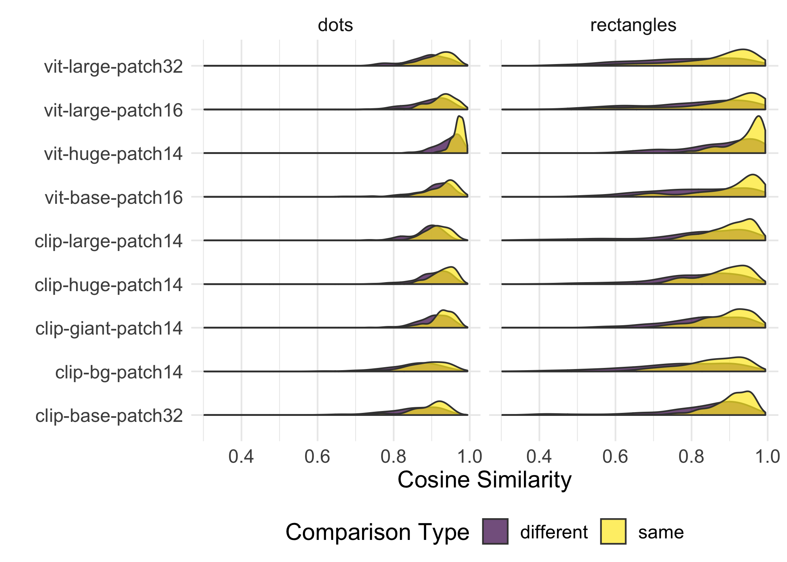
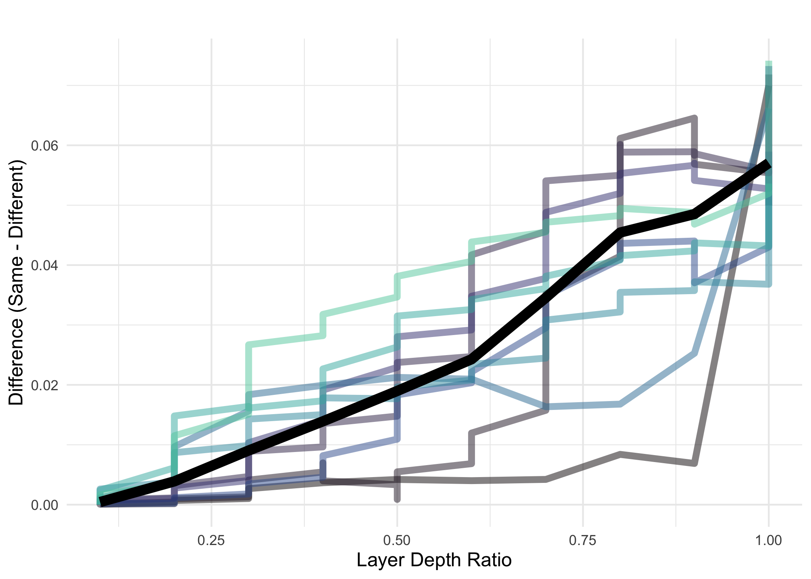
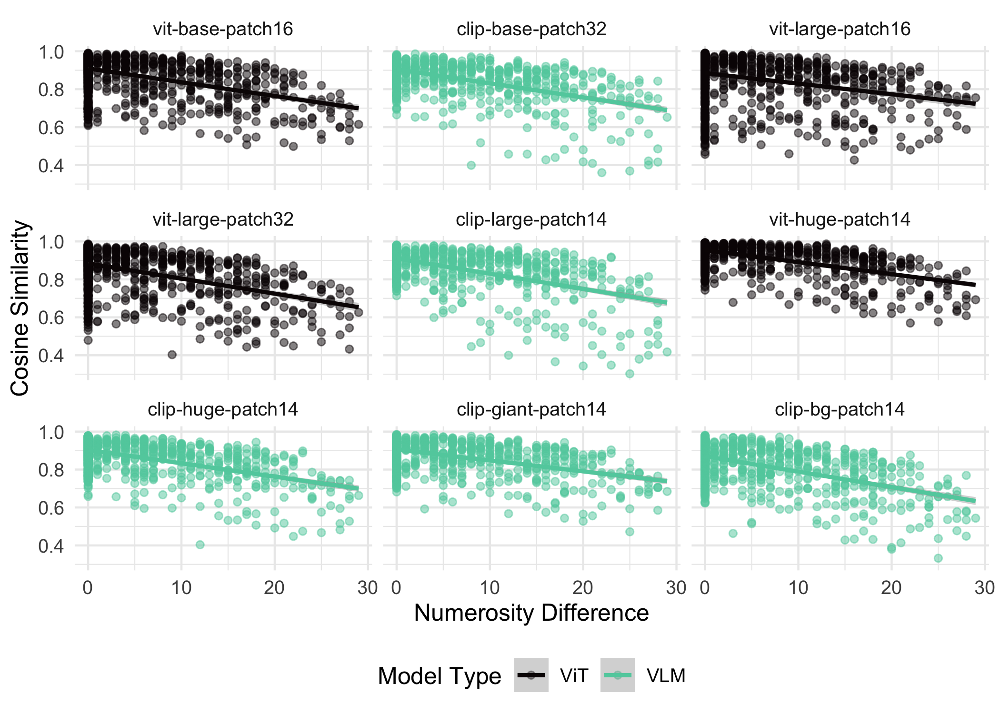
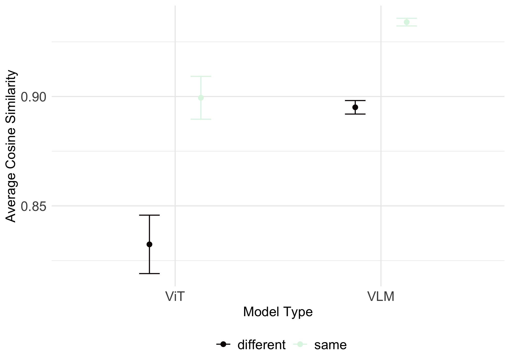
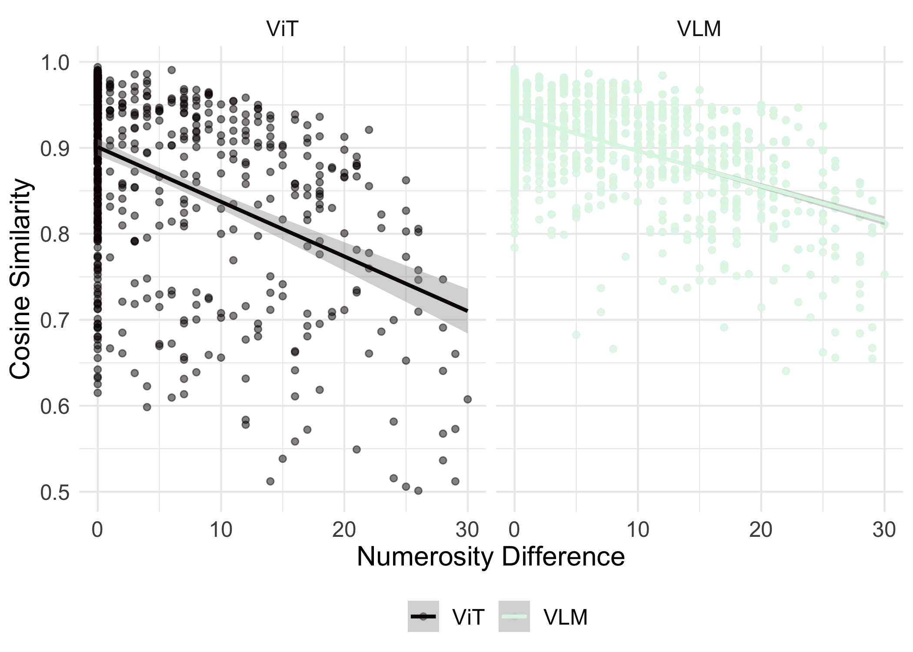

# Load data


```r
# setwd("/Users/seantrott/Dropbox/UCSD/Research/NLMs/vlm-vit-num/analysis")
directory_path <- "../results"
csv_files <- list.files(path = directory_path, pattern = "*.csv", full.names = TRUE)
csv_list <- csv_files %>%
  map(~ read_csv(.))
```

```
## New names:
## Rows: 3380 Columns: 13
## ── Column specification
## ──────────────────────────────────────────────────────── Delimiter: "," chr
## (5): model_name, image_type, image_1, image_2, numerosity_comparison_type dbl
## (8): ...1, cosine_similarity, numerosity_1, numerosity_2, area_diff, lay...
## ℹ Use `spec()` to retrieve the full column specification for this data. ℹ
## Specify the column types or set `show_col_types = FALSE` to quiet this message.
## New names:
## Rows: 8320 Columns: 13
## ── Column specification
## ──────────────────────────────────────────────────────── Delimiter: "," chr
## (5): model_name, image_type, image_1, image_2, numerosity_comparison_type dbl
## (8): ...1, cosine_similarity, numerosity_1, numerosity_2, area_diff, lay...
## ℹ Use `spec()` to retrieve the full column specification for this data. ℹ
## Specify the column types or set `show_col_types = FALSE` to quiet this message.
## New names:
## Rows: 12740 Columns: 13
## ── Column specification
## ──────────────────────────────────────────────────────── Delimiter: "," chr
## (5): model_name, image_type, image_1, image_2, numerosity_comparison_type dbl
## (8): ...1, cosine_similarity, numerosity_1, numerosity_2, area_diff, lay...
## ℹ Use `spec()` to retrieve the full column specification for this data. ℹ
## Specify the column types or set `show_col_types = FALSE` to quiet this message.
## New names:
## Rows: 31360 Columns: 13
## ── Column specification
## ──────────────────────────────────────────────────────── Delimiter: "," chr
## (5): model_name, image_type, image_1, image_2, numerosity_comparison_type dbl
## (8): ...1, cosine_similarity, numerosity_1, numerosity_2, area_diff, lay...
## ℹ Use `spec()` to retrieve the full column specification for this data. ℹ
## Specify the column types or set `show_col_types = FALSE` to quiet this message.
## New names:
## Rows: 10660 Columns: 13
## ── Column specification
## ──────────────────────────────────────────────────────── Delimiter: "," chr
## (5): model_name, image_type, image_1, image_2, numerosity_comparison_type dbl
## (8): ...1, cosine_similarity, numerosity_1, numerosity_2, area_diff, lay...
## ℹ Use `spec()` to retrieve the full column specification for this data. ℹ
## Specify the column types or set `show_col_types = FALSE` to quiet this message.
## New names:
## Rows: 26240 Columns: 13
## ── Column specification
## ──────────────────────────────────────────────────────── Delimiter: "," chr
## (5): model_name, image_type, image_1, image_2, numerosity_comparison_type dbl
## (8): ...1, cosine_similarity, numerosity_1, numerosity_2, area_diff, lay...
## ℹ Use `spec()` to retrieve the full column specification for this data. ℹ
## Specify the column types or set `show_col_types = FALSE` to quiet this message.
## New names:
## Rows: 8580 Columns: 13
## ── Column specification
## ──────────────────────────────────────────────────────── Delimiter: "," chr
## (5): model_name, image_type, image_1, image_2, numerosity_comparison_type dbl
## (8): ...1, cosine_similarity, numerosity_1, numerosity_2, area_diff, lay...
## ℹ Use `spec()` to retrieve the full column specification for this data. ℹ
## Specify the column types or set `show_col_types = FALSE` to quiet this message.
## New names:
## Rows: 21120 Columns: 13
## ── Column specification
## ──────────────────────────────────────────────────────── Delimiter: "," chr
## (5): model_name, image_type, image_1, image_2, numerosity_comparison_type dbl
## (8): ...1, cosine_similarity, numerosity_1, numerosity_2, area_diff, lay...
## ℹ Use `spec()` to retrieve the full column specification for this data. ℹ
## Specify the column types or set `show_col_types = FALSE` to quiet this message.
## New names:
## Rows: 6500 Columns: 13
## ── Column specification
## ──────────────────────────────────────────────────────── Delimiter: "," chr
## (5): model_name, image_type, image_1, image_2, numerosity_comparison_type dbl
## (8): ...1, cosine_similarity, numerosity_1, numerosity_2, area_diff, lay...
## ℹ Use `spec()` to retrieve the full column specification for this data. ℹ
## Specify the column types or set `show_col_types = FALSE` to quiet this message.
## New names:
## Rows: 16000 Columns: 13
## ── Column specification
## ──────────────────────────────────────────────────────── Delimiter: "," chr
## (5): model_name, image_type, image_1, image_2, numerosity_comparison_type dbl
## (8): ...1, cosine_similarity, numerosity_1, numerosity_2, area_diff, lay...
## ℹ Use `spec()` to retrieve the full column specification for this data. ℹ
## Specify the column types or set `show_col_types = FALSE` to quiet this message.
## New names:
## Rows: 3380 Columns: 13
## ── Column specification
## ──────────────────────────────────────────────────────── Delimiter: "," chr
## (5): model_name, image_type, image_1, image_2, numerosity_comparison_type dbl
## (8): ...1, cosine_similarity, numerosity_1, numerosity_2, area_diff, lay...
## ℹ Use `spec()` to retrieve the full column specification for this data. ℹ
## Specify the column types or set `show_col_types = FALSE` to quiet this message.
## New names:
## Rows: 8320 Columns: 13
## ── Column specification
## ──────────────────────────────────────────────────────── Delimiter: "," chr
## (5): model_name, image_type, image_1, image_2, numerosity_comparison_type dbl
## (8): ...1, cosine_similarity, numerosity_1, numerosity_2, area_diff, lay...
## ℹ Use `spec()` to retrieve the full column specification for this data. ℹ
## Specify the column types or set `show_col_types = FALSE` to quiet this message.
## New names:
## Rows: 8580 Columns: 13
## ── Column specification
## ──────────────────────────────────────────────────────── Delimiter: "," chr
## (5): model_name, image_type, image_1, image_2, numerosity_comparison_type dbl
## (8): ...1, cosine_similarity, numerosity_1, numerosity_2, area_diff, lay...
## ℹ Use `spec()` to retrieve the full column specification for this data. ℹ
## Specify the column types or set `show_col_types = FALSE` to quiet this message.
## New names:
## Rows: 21120 Columns: 13
## ── Column specification
## ──────────────────────────────────────────────────────── Delimiter: "," chr
## (5): model_name, image_type, image_1, image_2, numerosity_comparison_type dbl
## (8): ...1, cosine_similarity, numerosity_1, numerosity_2, area_diff, lay...
## ℹ Use `spec()` to retrieve the full column specification for this data. ℹ
## Specify the column types or set `show_col_types = FALSE` to quiet this message.
## New names:
## Rows: 6500 Columns: 13
## ── Column specification
## ──────────────────────────────────────────────────────── Delimiter: "," chr
## (5): model_name, image_type, image_1, image_2, numerosity_comparison_type dbl
## (8): ...1, cosine_similarity, numerosity_1, numerosity_2, area_diff, lay...
## ℹ Use `spec()` to retrieve the full column specification for this data. ℹ
## Specify the column types or set `show_col_types = FALSE` to quiet this message.
## New names:
## Rows: 16000 Columns: 13
## ── Column specification
## ──────────────────────────────────────────────────────── Delimiter: "," chr
## (5): model_name, image_type, image_1, image_2, numerosity_comparison_type dbl
## (8): ...1, cosine_similarity, numerosity_1, numerosity_2, area_diff, lay...
## ℹ Use `spec()` to retrieve the full column specification for this data. ℹ
## Specify the column types or set `show_col_types = FALSE` to quiet this message.
## New names:
## Rows: 6500 Columns: 13
## ── Column specification
## ──────────────────────────────────────────────────────── Delimiter: "," chr
## (5): model_name, image_type, image_1, image_2, numerosity_comparison_type dbl
## (8): ...1, cosine_similarity, numerosity_1, numerosity_2, area_diff, lay...
## ℹ Use `spec()` to retrieve the full column specification for this data. ℹ
## Specify the column types or set `show_col_types = FALSE` to quiet this message.
## New names:
## Rows: 16000 Columns: 13
## ── Column specification
## ──────────────────────────────────────────────────────── Delimiter: "," chr
## (5): model_name, image_type, image_1, image_2, numerosity_comparison_type dbl
## (8): ...1, cosine_similarity, numerosity_1, numerosity_2, area_diff, lay...
## ℹ Use `spec()` to retrieve the full column specification for this data. ℹ
## Specify the column types or set `show_col_types = FALSE` to quiet this message.
## • `` -> `...1`
```

```r
df_hf_models <- bind_rows(csv_list)


df_hf_models = df_hf_models %>%
  mutate(numerosity_diff = abs(numerosity_2 - numerosity_1)) %>%
  mutate(log_params = log10(n_params)) %>%
  group_by(model_name) %>%
  mutate(max_layer = max(layer)) %>%
  mutate(model_type = case_when(
    str_detect(model_name, "clip") == TRUE ~ "VLM",
    TRUE ~ "ViT"))  %>%
  mutate(cosine_similarity_z = scale(cosine_similarity),
         numerosity_diff_z = scale(numerosity_diff),
         area_diff_z = scale(area_diff)) %>%
  mutate(model_name2 = str_extract(model_name, "^(?:[^-]*-?){1,3}[^-]*"))


table(df_hf_models$model_name)
```

```
## 
##  clip-base-patch32    clip-bg-patch14 clip-giant-patch14  clip-huge-patch14 
##              11700              44100              36900              29700 
## clip-large-patch14   vit-base-patch16   vit-huge-patch14  vit-large-patch16 
##              22500              11700              29700              22500 
##  vit-large-patch32 
##              22500
```

```r
table(df_hf_models$model_name, df_hf_models$numerosity_comparison_type)
```

```
##                     
##                      different  same
##   clip-base-patch32       5850  5850
##   clip-bg-patch14        22050 22050
##   clip-giant-patch14     18450 18450
##   clip-huge-patch14      14850 14850
##   clip-large-patch14     11250 11250
##   vit-base-patch16        5850  5850
##   vit-huge-patch14       14850 14850
##   vit-large-patch16      11250 11250
##   vit-large-patch32      11250 11250
```

```r
table(df_hf_models$model_name, df_hf_models$image_type)
```

```
##                     
##                       dots rectangles
##   clip-base-patch32   3380       8320
##   clip-bg-patch14    12740      31360
##   clip-giant-patch14 10660      26240
##   clip-huge-patch14   8580      21120
##   clip-large-patch14  6500      16000
##   vit-base-patch16    3380       8320
##   vit-huge-patch14    8580      21120
##   vit-large-patch16   6500      16000
##   vit-large-patch32   6500      16000
```

```r
## Take a look again at the rescaled area differences
df_hf_models %>% 
  ggplot(aes(x = area_diff,
             y = cosine_similarity,
             color = model_type)) + 
  geom_point(alpha=0.1) + 
  geom_smooth(method = "lm", se = FALSE) +
  theme_minimal() +
  scale_color_manual(values = viridisLite::viridis(2, option = "mako", begin = 0, end = 0.8)) +
  facet_wrap(~model_type) 
```

```
## `geom_smooth()` using formula = 'y ~ x'
```

<!-- -->


# Descriptive analyses


```r
df_hf_models %>%
  filter(layer == max_layer) %>%
  ggplot(aes(x = cosine_similarity)) +
  geom_histogram(alpha = .6) +
  theme_minimal() +
  labs(x = "Cosine Similarity") +
  theme(text = element_text(size = 15)) +
  facet_wrap(~model_name)
```

```
## `stat_bin()` using `bins = 30`. Pick better value with `binwidth`.
```

<!-- -->

# Analyses

## Same Vs. Different Numerosity


```r
df_summary <- df_hf_models %>%
  group_by(model_name2, numerosity_comparison_type, layer, max_layer, image_type) %>%
  summarize(avg_similarity = mean(cosine_similarity, na.rm = TRUE),
            se_similarity = sd(cosine_similarity, na.rm = TRUE) / sqrt(n()))
```

```
## `summarise()` has grouped output by 'model_name2',
## 'numerosity_comparison_type', 'layer', 'max_layer'. You can override using the
## `.groups` argument.
```

```r
df_summary %>%
  filter(layer == max_layer) %>%
  ggplot(aes(x = model_name2,
             y = avg_similarity,
             fill = numerosity_comparison_type)) +
  geom_bar(stat = "identity", position = position_dodge(width = 0.5), width = .6) +  
  # geom_point(position = position_dodge(width = 0.5)) +
  geom_errorbar(aes(ymin = avg_similarity - se_similarity, 
                    ymax = avg_similarity + se_similarity), 
                width = 0.2,
                position = position_dodge(width = 0.5)) + 
  labs(# title = "",
       x = "Model",
       y = "Average Cosine Similarity",
       fill = "",
       color = "") +
  theme_minimal() +
  coord_flip() +
  scale_fill_viridis(discrete=TRUE) +
  # scale_color_viridis_d() +
  scale_y_continuous(n.breaks = 3) +
  theme(axis.title = element_text(size=rel(1.2)),
        axis.text = element_text(size = rel(1.2)),
        legend.text = element_text(size = rel(1.2)),
        # legend.title = element_text(size = rel(1.5)),
        strip.text.x = element_text(size = rel(1.2)),
        legend.position = "bottom") +
  facet_wrap(~image_type)
```

<!-- -->

```r
df_hf_models %>%
  filter(layer == max_layer) %>%
  ggplot(aes(x = cosine_similarity,
             y = model_name,
             fill = numerosity_comparison_type)) +
  geom_density_ridges2(aes(height = ..density..), 
                       color=gray(0.25), 
                       alpha = .7, 
                       scale=.85, 
                       # size=1, 
                       size = 0,
                       stat="density") +
  labs(x = "Cosine Similarity",
       y = "",
       fill = "Comparison Type") +
  theme_minimal() +
  scale_fill_viridis(discrete=TRUE) +
  theme(text = element_text(size = 15),
        legend.position="bottom") +
  facet_wrap(~image_type)
```

```
## Warning in geom_density_ridges2(aes(height = ..density..), color = gray(0.25),
## : Ignoring unknown parameters: `size`
```

```
## Warning: The dot-dot notation (`..density..`) was deprecated in ggplot2 3.4.0.
## ℹ Please use `after_stat(density)` instead.
## This warning is displayed once every 8 hours.
## Call `lifecycle::last_lifecycle_warnings()` to see where this warning was
## generated.
```

<!-- -->

```r
### Overall sensitivity
m1 = lmer(data = df_hf_models,
          cosine_similarity ~ area_diff + numerosity_comparison_type + 
            (1 | image_1) + (1 | image_2) + 
            (1 |model_name) + (1|image_type),
          control=lmerControl(optimizer="bobyqa"))

summary(m1)
```

```
## Linear mixed model fit by REML. t-tests use Satterthwaite's method [
## lmerModLmerTest]
## Formula: cosine_similarity ~ area_diff + numerosity_comparison_type +  
##     (1 | image_1) + (1 | image_2) + (1 | model_name) + (1 | image_type)
##    Data: df_hf_models
## Control: lmerControl(optimizer = "bobyqa")
## 
## REML criterion at convergence: -648964.2
## 
## Scaled residuals: 
##     Min      1Q  Median      3Q     Max 
## -8.9772 -0.3122  0.1044  0.5046  3.8459 
## 
## Random effects:
##  Groups     Name        Variance  Std.Dev.
##  image_1    (Intercept) 0.0004657 0.02158 
##  image_2    (Intercept) 0.0004479 0.02116 
##  model_name (Intercept) 0.0003195 0.01787 
##  image_type (Intercept) 0.0002491 0.01578 
##  Residual               0.0034547 0.05878 
## Number of obs: 231300, groups:  
## image_1, 1412; image_2, 1318; model_name, 9; image_type, 2
## 
## Fixed effects:
##                                  Estimate Std. Error         df t value
## (Intercept)                     9.559e-01  1.270e-02  1.634e+00  75.242
## area_diff                      -4.949e-06  1.049e-06  2.488e+03  -4.717
## numerosity_comparison_typesame  1.658e-02  8.549e-04  2.646e+03  19.388
##                                Pr(>|t|)    
## (Intercept)                    0.000693 ***
## area_diff                      2.52e-06 ***
## numerosity_comparison_typesame  < 2e-16 ***
## ---
## Signif. codes:  0 '***' 0.001 '**' 0.01 '*' 0.05 '.' 0.1 ' ' 1
## 
## Correlation of Fixed Effects:
##             (Intr) ar_dff
## area_diff   -0.046       
## nmrsty_cmp_ -0.046  0.210
```

```r
### Interaction with layer
m1 = lmer(data = df_hf_models,
          cosine_similarity ~ area_diff *layer + numerosity_comparison_type * layer + 
            (1 | image_1) + (1 | image_2) + 
            (1 |model_name) + (1|image_type))
```

```
## Warning: Some predictor variables are on very different scales: consider
## rescaling
```

```
## Warning: Some predictor variables are on very different scales: consider
## rescaling
```

```r
summary(m1)
```

```
## Linear mixed model fit by REML. t-tests use Satterthwaite's method [
## lmerModLmerTest]
## Formula: cosine_similarity ~ area_diff * layer + numerosity_comparison_type *  
##     layer + (1 | image_1) + (1 | image_2) + (1 | model_name) +  
##     (1 | image_type)
##    Data: df_hf_models
## 
## REML criterion at convergence: -814492.9
## 
## Scaled residuals: 
##      Min       1Q   Median       3Q      Max 
## -11.4532  -0.3767   0.0956   0.4923   4.8630 
## 
## Random effects:
##  Groups     Name        Variance  Std.Dev.
##  image_1    (Intercept) 0.0004855 0.02203 
##  image_2    (Intercept) 0.0004651 0.02157 
##  model_name (Intercept) 0.0003162 0.01778 
##  image_type (Intercept) 0.0002612 0.01616 
##  Residual               0.0016785 0.04097 
## Number of obs: 231300, groups:  
## image_1, 1412; image_2, 1318; model_name, 9; image_type, 2
## 
## Fixed effects:
##                                        Estimate Std. Error         df  t value
## (Intercept)                           1.028e+00  1.293e-02  1.615e+00   79.500
## area_diff                            -1.445e-05  1.027e-06  2.521e+03  -14.069
## layer                                -5.100e-03  1.267e-05  2.305e+05 -402.446
## numerosity_comparison_typesame       -8.050e-03  8.407e-04  2.871e+03   -9.575
## area_diff:layer                       6.593e-07  1.552e-08  2.313e+05   42.473
## layer:numerosity_comparison_typesame  1.623e-03  1.535e-05  2.309e+05  105.736
##                                      Pr(>|t|)    
## (Intercept)                           0.00068 ***
## area_diff                             < 2e-16 ***
## layer                                 < 2e-16 ***
## numerosity_comparison_typesame        < 2e-16 ***
## area_diff:layer                       < 2e-16 ***
## layer:numerosity_comparison_typesame  < 2e-16 ***
## ---
## Signif. codes:  0 '***' 0.001 '**' 0.01 '*' 0.05 '.' 0.1 ' ' 1
## 
## Correlation of Fixed Effects:
##             (Intr) ar_dff layer  nmrs__ ar_df:
## area_diff   -0.044                            
## layer       -0.014  0.092                     
## nmrsty_cmp_ -0.044  0.214  0.170              
## are_dff:lyr  0.006 -0.206 -0.430 -0.021       
## lyr:nmrst__  0.009 -0.021 -0.635 -0.268  0.076
## fit warnings:
## Some predictor variables are on very different scales: consider rescaling
```

```r
## Plot differences by layer
summary_df <- df_hf_models %>%
  group_by(model_name, layer, numerosity_comparison_type) %>%
  summarize(mean_cosine = mean(cosine_similarity, na.rm = TRUE), .groups = 'drop')

difference_df <- summary_df %>%
  pivot_wider(names_from = numerosity_comparison_type, values_from = mean_cosine) %>%
  mutate(difference = same - different) %>%
  group_by(model_name) %>%
  mutate(max_layer = max(layer),
         prop_layer = layer / max_layer) %>%
  mutate(binned_prop_layer = ntile(prop_layer, 10)) %>%
  mutate(prop_binned = binned_prop_layer / 10) 


smoothed_data <- difference_df %>%
  group_by(prop_binned) %>%
  summarize(avg_difference = mean(difference, na.rm = TRUE)) %>%
  mutate(model_name = "Average")

# Create the plot
difference_df %>%
  ggplot(aes(x = prop_binned, y = difference, 
             color = model_name, group = model_name)) +
  geom_line(alpha = 0.5, linewidth=2) + # Individual lines for each model_name
  geom_line(data = smoothed_data, aes(x = prop_binned, y = avg_difference), 
             color = "black", linewidth = 3) + # Smoothed average
  labs(
    title = "",
    x = "Layer Depth Ratio",
    y = "Difference (Same - Different)",
    color = ""
  ) +
  theme_minimal() +
  scale_color_manual(values = viridisLite::viridis(9, option = "mako", begin = 0, end = 0.8))  +
  theme(
    plot.title = element_text(hjust = 0.5, size = 14, face = "bold"),
    axis.title = element_text(size = 12),
    legend.title = element_text(size = 12),
    legend.position = "none")
```

<!-- -->

```r
## Visualize area difference interaction with layer 
ggplot(df_hf_models, aes(x = area_diff, y = cosine_similarity, color = as.factor(layer))) +
  geom_smooth(method = "lm", se = FALSE) +
  facet_wrap(~ model_name) +
  scale_color_manual(values = viridisLite::viridis(50, option = "mako", begin = 0, end = 0.8)) +
  labs(
    title = "Interaction between Area Difference and Layer",
    x = "Area Difference",
    y = "Cosine Similarity",
    color = "Layer"
  ) +
  theme_minimal()
```

```
## `geom_smooth()` using formula = 'y ~ x'
```

<!-- -->

```r
## Subset by image type, to check that area diffs above are capturing 
#  the within-image-type area difference variation
# Rectangles
df_hf_models %>%
  filter(image_type == "rectangles") %>%
  ggplot(aes(x = area_diff, y = cosine_similarity, color = as.factor(layer))) +
  geom_smooth(method = "lm", se = FALSE) +
  facet_wrap(~ model_name) +
  scale_color_manual(values = viridisLite::viridis(50, option = "mako", begin = 0, end = 0.8)) +
  labs(
    title = "Rectangles - Interaction between Area Difference and Layer",
    x = "Area Difference",
    y = "Cosine Similarity",
    color = "Layer"
  ) +
  theme_minimal()
```

```
## `geom_smooth()` using formula = 'y ~ x'
```

<!-- -->

```r
# Dots
df_hf_models %>%
  filter(image_type == "dots") %>%
  ggplot(aes(x = area_diff, y = cosine_similarity, color = as.factor(layer))) +
  geom_smooth(method = "lm", se = FALSE) +
  facet_wrap(~ model_name) +
  scale_color_manual(values = viridisLite::viridis(50, option = "mako", begin = 0, end = 0.8)) +
  labs(
    title = "Dots - Interaction between Area Difference and Layer",
    x = "Area Difference",
    y = "Cosine Similarity",
    color = "Layer"
  ) +
  theme_minimal()
```

```
## `geom_smooth()` using formula = 'y ~ x'
```

<!-- -->


## Continuous function of numerosity


```r
df_hf_models <- df_hf_models %>%
  mutate(model_name2 = str_extract(model_name, "^(?:[^-]*-?){1,3}[^-]*"))

df_hf_models %>%
  filter(layer == max_layer) %>%
  ggplot(aes(x = numerosity_diff,
             y = cosine_similarity,
             color = model_type)) +
  geom_point(alpha = .5) +
  geom_smooth(method = "lm") +
  theme_minimal() +
  scale_color_manual(values = viridisLite::viridis(2, option = "mako", begin = 0, end = 0.8)) +
  labs(# title = "",
       x = "Numerosity Difference",
       y = "Cosine Similarity",
       fill = "",
       color = "Model Type") +
  theme(text = element_text(size = 12),
        legend.position = "bottom") +
  facet_wrap(~reorder(model_name2, n_params))
```

```
## `geom_smooth()` using formula = 'y ~ x'
```

<!-- -->

```r
### Overall sensitivity, all layers
m1 = lmer(data = df_hf_models,
          cosine_similarity ~ area_diff + numerosity_diff + 
            (1 | image_1) + (1 | image_2) + 
            (1 |model_name) + (1|image_type),
          control=lmerControl(optimizer="bobyqa"))

summary(m1)
```

```
## Linear mixed model fit by REML. t-tests use Satterthwaite's method [
## lmerModLmerTest]
## Formula: cosine_similarity ~ area_diff + numerosity_diff + (1 | image_1) +  
##     (1 | image_2) + (1 | model_name) + (1 | image_type)
##    Data: df_hf_models
## Control: lmerControl(optimizer = "bobyqa")
## 
## REML criterion at convergence: -649512.2
## 
## Scaled residuals: 
##     Min      1Q  Median      3Q     Max 
## -8.9699 -0.3114  0.1038  0.5043  3.8516 
## 
## Random effects:
##  Groups     Name        Variance  Std.Dev.
##  image_1    (Intercept) 0.0003325 0.01823 
##  image_2    (Intercept) 0.0003363 0.01834 
##  model_name (Intercept) 0.0003178 0.01783 
##  image_type (Intercept) 0.0001416 0.01190 
##  Residual               0.0034544 0.05877 
## Number of obs: 231300, groups:  
## image_1, 1412; image_2, 1318; model_name, 9; image_type, 2
## 
## Fixed effects:
##                   Estimate Std. Error         df t value Pr(>|t|)    
## (Intercept)      9.725e-01  1.034e-02  2.173e+00  94.060  5.8e-05 ***
## area_diff       -1.082e-06  9.392e-07  2.569e+03  -1.152    0.249    
## numerosity_diff -2.145e-03  6.362e-05  2.371e+03 -33.707  < 2e-16 ***
## ---
## Signif. codes:  0 '***' 0.001 '**' 0.01 '*' 0.05 '.' 0.1 ' ' 1
## 
## Correlation of Fixed Effects:
##             (Intr) ar_dff
## area_diff   -0.035       
## numrsty_dff -0.015 -0.258
```

```r
### Overall sensitivity, at the last layer
m1 = lmer(data = filter(df_hf_models, layer == max_layer),
          cosine_similarity ~ area_diff + numerosity_diff + 
            (1 | image_1) + (1 | image_2) + 
            (1 |model_name) + (1|image_type),
          control=lmerControl(optimizer="bobyqa"))

summary(m1)
```

```
## Linear mixed model fit by REML. t-tests use Satterthwaite's method [
## lmerModLmerTest]
## Formula: cosine_similarity ~ area_diff + numerosity_diff + (1 | image_1) +  
##     (1 | image_2) + (1 | model_name) + (1 | image_type)
##    Data: filter(df_hf_models, layer == max_layer)
## Control: lmerControl(optimizer = "bobyqa")
## 
## REML criterion at convergence: -22460
## 
## Scaled residuals: 
##     Min      1Q  Median      3Q     Max 
## -6.0533 -0.3717  0.0626  0.4907  3.3163 
## 
## Random effects:
##  Groups     Name        Variance  Std.Dev.
##  image_1    (Intercept) 0.0022208 0.04713 
##  image_2    (Intercept) 0.0023204 0.04817 
##  model_name (Intercept) 0.0007499 0.02738 
##  image_type (Intercept) 0.0012261 0.03502 
##  Residual               0.0023580 0.04856 
## Number of obs: 8100, groups:  
## image_1, 1412; image_2, 1318; model_name, 9; image_type, 2
## 
## Fixed effects:
##                   Estimate Std. Error         df t value Pr(>|t|)    
## (Intercept)      9.118e-01  2.651e-02  1.287e+00  34.400 0.007257 ** 
## area_diff       -1.022e-05  2.778e-06  2.918e+03  -3.679 0.000238 ***
## numerosity_diff -5.892e-03  1.864e-04  2.579e+03 -31.614  < 2e-16 ***
## ---
## Signif. codes:  0 '***' 0.001 '**' 0.01 '*' 0.05 '.' 0.1 ' ' 1
## 
## Correlation of Fixed Effects:
##             (Intr) ar_dff
## area_diff   -0.041       
## numrsty_dff -0.019 -0.236
```

```r
### Interactions with layer
m1 = lmer(data = df_hf_models,
          cosine_similarity ~ area_diff * layer +  numerosity_diff * layer +
            (1 | image_1) + (1 | image_2) + 
            (1 |model_name) + (1|image_type),
          control=lmerControl(optimizer="bobyqa"))
```

```
## Warning: Some predictor variables are on very different scales: consider
## rescaling

## Warning: Some predictor variables are on very different scales: consider
## rescaling
```

```r
summary(m1)
```

```
## Linear mixed model fit by REML. t-tests use Satterthwaite's method [
## lmerModLmerTest]
## Formula: cosine_similarity ~ area_diff * layer + numerosity_diff * layer +  
##     (1 | image_1) + (1 | image_2) + (1 | model_name) + (1 | image_type)
##    Data: df_hf_models
## Control: lmerControl(optimizer = "bobyqa")
## 
## REML criterion at convergence: -834543.9
## 
## Scaled residuals: 
##      Min       1Q   Median       3Q      Max 
## -11.9861  -0.3765   0.1007   0.4890   5.4463 
## 
## Random effects:
##  Groups     Name        Variance  Std.Dev.
##  image_1    (Intercept) 0.0003409 0.01846 
##  image_2    (Intercept) 0.0003473 0.01864 
##  model_name (Intercept) 0.0003246 0.01802 
##  image_type (Intercept) 0.0001639 0.01280 
##  Residual               0.0015419 0.03927 
## Number of obs: 231300, groups:  
## image_1, 1412; image_2, 1318; model_name, 9; image_type, 2
## 
## Fixed effects:
##                         Estimate Std. Error         df t value Pr(>|t|)    
## (Intercept)            1.018e+00  1.090e-02  2.019e+00   93.35 0.000107 ***
## area_diff             -1.003e-05  9.047e-07  2.623e+03  -11.09  < 2e-16 ***
## layer                 -3.329e-03  1.068e-05  2.304e+05 -311.79  < 2e-16 ***
## numerosity_diff        6.035e-04  6.215e-05  2.589e+03    9.71  < 2e-16 ***
## area_diff:layer        6.084e-07  1.482e-08  2.312e+05   41.04  < 2e-16 ***
## layer:numerosity_diff -1.797e-04  9.967e-07  2.304e+05 -180.32  < 2e-16 ***
## ---
## Signif. codes:  0 '***' 0.001 '**' 0.01 '*' 0.05 '.' 0.1 ' ' 1
## 
## Correlation of Fixed Effects:
##             (Intr) ar_dff layer  nmrst_ ar_df:
## area_diff   -0.031                            
## layer       -0.014  0.092                     
## numrsty_dff -0.014 -0.263  0.115              
## are_dff:lyr  0.006 -0.223 -0.422  0.006       
## lyr:nmrsty_  0.007  0.012 -0.478 -0.239 -0.028
## fit warnings:
## Some predictor variables are on very different scales: consider rescaling
```

## Continuous function of numerosity: ratio

```r
df_hf_models$numerosity_ratio <- df_hf_models$numerosity_1 / df_hf_models$numerosity_2

df_hf_models %>%
  ggplot(aes(x = numerosity_ratio)) + 
  geom_histogram(alpha = .6) +
  theme_minimal() 
```

```
## `stat_bin()` using `bins = 30`. Pick better value with `binwidth`.
```

<!-- -->

```r
mnumrat = lmer(data = df_hf_models, 
                cosine_similarity ~ 
                  area_diff * model_type + 
                  numerosity_ratio * model_type + 
                  patch_size + log_params + 
                  (1 | image_1) + (1 | image_2) + 
                  (1 | image_type) + (1 | model_name)
                  )
```

```
## Warning: Some predictor variables are on very different scales: consider
## rescaling

## Warning: Some predictor variables are on very different scales: consider
## rescaling
```

```r
summary(mnumrat)
```

```
## Linear mixed model fit by REML. t-tests use Satterthwaite's method [
## lmerModLmerTest]
## Formula: cosine_similarity ~ area_diff * model_type + numerosity_ratio *  
##     model_type + patch_size + log_params + (1 | image_1) + (1 |  
##     image_2) + (1 | image_type) + (1 | model_name)
##    Data: df_hf_models
## 
## REML criterion at convergence: -649248.6
## 
## Scaled residuals: 
##     Min      1Q  Median      3Q     Max 
## -8.8962 -0.3114  0.1043  0.5041  4.0857 
## 
## Random effects:
##  Groups     Name        Variance  Std.Dev.
##  image_1    (Intercept) 0.0004438 0.02107 
##  image_2    (Intercept) 0.0003708 0.01926 
##  model_name (Intercept) 0.0002321 0.01523 
##  image_type (Intercept) 0.0002221 0.01490 
##  Residual               0.0034524 0.05876 
## Number of obs: 231300, groups:  
## image_1, 1412; image_2, 1318; model_name, 9; image_type, 2
## 
## Fixed effects:
##                                  Estimate Std. Error         df t value
## (Intercept)                     1.264e+00  1.391e-01  5.053e+00   9.089
## area_diff                      -1.269e-05  1.176e-06  2.802e+03 -10.785
## model_typeVLM                   1.168e-02  1.196e-02  5.009e+00   0.977
## numerosity_ratio               -7.779e-03  3.220e-04  1.966e+03 -24.155
## patch_size                     -1.174e-04  8.089e-04  5.006e+00  -0.145
## log_params                     -3.355e-02  1.543e-02  4.994e+00  -2.174
## area_diff:model_typeVLM         9.816e-06  1.526e-06  2.704e+03   6.433
## model_typeVLM:numerosity_ratio -7.944e-04  1.111e-04  2.304e+05  -7.151
##                                Pr(>|t|)    
## (Intercept)                    0.000255 ***
## area_diff                       < 2e-16 ***
## model_typeVLM                  0.373564    
## numerosity_ratio                < 2e-16 ***
## patch_size                     0.890286    
## log_params                     0.081754 .  
## area_diff:model_typeVLM        1.47e-10 ***
## model_typeVLM:numerosity_ratio 8.64e-13 ***
## ---
## Signif. codes:  0 '***' 0.001 '**' 0.01 '*' 0.05 '.' 0.1 ' ' 1
## 
## Correlation of Fixed Effects:
##             (Intr) ar_dff md_VLM nmrst_ ptch_s lg_prm a_:_VL
## area_diff   -0.003                                          
## modl_typVLM  0.456  0.008                                   
## numersty_rt -0.003 -0.019  0.003                            
## patch_size  -0.576  0.000 -0.154  0.000                     
## log_params  -0.991  0.000 -0.507  0.000  0.495              
## ar_dff:_VLM  0.001 -0.551 -0.014 -0.005 -0.001  0.000       
## mdl_tyVLM:_  0.001 -0.016 -0.015 -0.212  0.000  0.000  0.031
## fit warnings:
## Some predictor variables are on very different scales: consider rescaling
```

# VLM vs. ViT

## Same vs. Different


```r
df_hf_models = df_hf_models %>%
  mutate(model_type = case_when(
    str_detect(model_name, "clip") == TRUE ~ "VLM",
    TRUE ~ "ViT")) %>%
  group_by(model_name) %>%
  mutate(max_layer = max(layer))

df_summary <- df_hf_models %>%
  filter(layer == max_layer) %>%
  group_by(model_type, numerosity_comparison_type) %>%
  summarize(avg_similarity = mean(cosine_similarity, na.rm = TRUE),
            se_similarity = sd(cosine_similarity, na.rm = TRUE) / sqrt(n()))
```

```
## `summarise()` has grouped output by 'model_type'. You can override using the
## `.groups` argument.
```

```r
df_summary %>%
  ggplot(aes(x = factor(model_type),
             y = avg_similarity,
             color = numerosity_comparison_type)) +
  geom_point(position = position_dodge(width = 0.5), size = 6) +  
  geom_errorbar(aes(ymin = avg_similarity - 2 * se_similarity, 
                    ymax = avg_similarity + 2 * se_similarity), 
                width = 0.6,
                size = 2,
                position = position_dodge(width = 0.5)) + 
  labs(# title = "",
       x = "Model Type",
       y = "Average Cosine Similarity",
       color = "") +
  theme_minimal() +
  scale_color_manual(values = viridisLite::viridis(2, option = "mako", begin = 0, end = 0.8)) +
  theme(axis.title = element_text(size=rel(1.2)),
        axis.text = element_text(size = rel(1.2)),
        legend.text = element_text(size = rel(1.2)),
        # legend.title = element_text(size = rel(1.5)),
        strip.text.x = element_text(size = rel(1.2)),
        legend.position = "bottom") 
```

```
## Warning: Using `size` aesthetic for lines was deprecated in ggplot2 3.4.0.
## ℹ Please use `linewidth` instead.
## This warning is displayed once every 8 hours.
## Call `lifecycle::last_lifecycle_warnings()` to see where this warning was
## generated.
```

<!-- -->

```r
m1 = lmer(data = filter(df_hf_models, layer == max_layer),
          cosine_similarity ~ area_diff * model_type + 
            numerosity_comparison_type * model_type + 
            patch_size * numerosity_comparison_type  + 
            log_params * numerosity_comparison_type + 
            (1 | image_1) + (1 | image_2) + (1|image_type) +
            (1|model_name),
          control=lmerControl(optimizer="bobyqa"))
```

```
## Warning: Some predictor variables are on very different scales: consider
## rescaling
```

```
## Warning: Some predictor variables are on very different scales: consider
## rescaling
```

```r
summary(m1)
```

```
## Linear mixed model fit by REML. t-tests use Satterthwaite's method [
## lmerModLmerTest]
## Formula: 
## cosine_similarity ~ area_diff * model_type + numerosity_comparison_type *  
##     model_type + patch_size * numerosity_comparison_type + log_params *  
##     numerosity_comparison_type + (1 | image_1) + (1 | image_2) +  
##     (1 | image_type) + (1 | model_name)
##    Data: filter(df_hf_models, layer == max_layer)
## Control: lmerControl(optimizer = "bobyqa")
## 
## REML criterion at convergence: -21943.5
## 
## Scaled residuals: 
##     Min      1Q  Median      3Q     Max 
## -6.1766 -0.3656  0.0602  0.4837  3.2152 
## 
## Random effects:
##  Groups     Name        Variance Std.Dev.
##  image_1    (Intercept) 0.003002 0.05479 
##  image_2    (Intercept) 0.002978 0.05457 
##  model_name (Intercept) 0.001008 0.03175 
##  image_type (Intercept) 0.002041 0.04518 
##  Residual               0.002368 0.04866 
## Number of obs: 8100, groups:  
## image_1, 1412; image_2, 1318; model_name, 9; image_type, 2
## 
## Fixed effects:
##                                                Estimate Std. Error         df
## (Intercept)                                   1.075e+00  2.916e-01  5.151e+00
## area_diff                                    -2.115e-05  3.628e-06  2.999e+03
## model_typeVLM                                -3.427e-03  2.501e-02  5.041e+00
## numerosity_comparison_typesame                7.160e-02  3.180e-02  7.024e+03
## patch_size                                   -1.822e-03  1.690e-03  5.024e+00
## log_params                                   -2.038e-02  3.224e-02  5.031e+00
## area_diff:model_typeVLM                       4.980e-06  4.643e-06  2.642e+03
## model_typeVLM:numerosity_comparison_typesame  6.231e-03  2.811e-03  7.139e+03
## numerosity_comparison_typesame:patch_size     5.462e-04  1.775e-04  6.559e+03
## numerosity_comparison_typesame:log_params    -4.035e-03  3.549e-03  7.020e+03
##                                              t value Pr(>|t|)    
## (Intercept)                                    3.687   0.0135 *  
## area_diff                                     -5.830 6.12e-09 ***
## model_typeVLM                                 -0.137   0.8963    
## numerosity_comparison_typesame                 2.251   0.0244 *  
## patch_size                                    -1.078   0.3299    
## log_params                                    -0.632   0.5549    
## area_diff:model_typeVLM                        1.073   0.2835    
## model_typeVLM:numerosity_comparison_typesame   2.217   0.0267 *  
## numerosity_comparison_typesame:patch_size      3.077   0.0021 ** 
## numerosity_comparison_typesame:log_params     -1.137   0.2556    
## ---
## Signif. codes:  0 '***' 0.001 '**' 0.01 '*' 0.05 '.' 0.1 ' ' 1
## 
## Correlation of Fixed Effects:
##                        (Intr) ar_dff md_VLM nmrs__ ptch_s lg_prm a_:_VL m_VLM:
## area_diff              -0.005                                                 
## modl_typVLM             0.455  0.016                                          
## nmrsty_cmp_            -0.055  0.010 -0.026                                   
## patch_size             -0.574  0.000 -0.154  0.030                            
## log_params             -0.988 -0.001 -0.507  0.055  0.495                     
## ar_dff:_VLM             0.001 -0.555 -0.027  0.007 -0.001  0.001              
## mdl_tVLM:__            -0.025 -0.046 -0.058  0.455  0.008  0.028  0.063       
## nmrsty_cmprsn_typsm:p_  0.031  0.009  0.009 -0.563 -0.053 -0.027 -0.003 -0.159
## nmrsty_cmprsn_typsm:l_  0.054  0.004  0.029 -0.992 -0.026 -0.055 -0.010 -0.502
##                        nmrsty_cmprsn_typsm:p_
## area_diff                                    
## modl_typVLM                                  
## nmrsty_cmp_                                  
## patch_size                                   
## log_params                                   
## ar_dff:_VLM                                  
## mdl_tVLM:__                                  
## nmrsty_cmprsn_typsm:p_                       
## nmrsty_cmprsn_typsm:l_  0.485                
## fit warnings:
## Some predictor variables are on very different scales: consider rescaling
```

### Multiverse analysis

Significant interaction does not always hold up under alternative model specifications, though it is generally trending / positive.


```r
m1 = lmer(data = filter(df_hf_models, layer == max_layer),
          cosine_similarity ~ # area_diff * model_type + 
            numerosity_comparison_type * model_type + 
            patch_size * numerosity_comparison_type  + 
            log_params * numerosity_comparison_type +
            (1 | image_1) + (1 | image_2) + (1|image_type) +
            (1|model_name))

summary(m1)
```

```
## Linear mixed model fit by REML. t-tests use Satterthwaite's method [
## lmerModLmerTest]
## Formula: cosine_similarity ~ numerosity_comparison_type * model_type +  
##     patch_size * numerosity_comparison_type + log_params * numerosity_comparison_type +  
##     (1 | image_1) + (1 | image_2) + (1 | image_type) + (1 | model_name)
##    Data: filter(df_hf_models, layer == max_layer)
## 
## REML criterion at convergence: -21949.5
## 
## Scaled residuals: 
##     Min      1Q  Median      3Q     Max 
## -6.1632 -0.3638  0.0592  0.4850  3.2172 
## 
## Random effects:
##  Groups     Name        Variance Std.Dev.
##  image_1    (Intercept) 0.003074 0.05545 
##  image_2    (Intercept) 0.003011 0.05487 
##  model_name (Intercept) 0.001007 0.03173 
##  image_type (Intercept) 0.001215 0.03485 
##  Residual               0.002372 0.04871 
## Number of obs: 8100, groups:  
## image_1, 1412; image_2, 1318; model_name, 9; image_type, 2
## 
## Fixed effects:
##                                                Estimate Std. Error         df
## (Intercept)                                   1.065e+00  2.907e-01  5.103e+00
## numerosity_comparison_typesame                7.464e-02  3.184e-02  7.033e+03
## model_typeVLM                                -2.465e-03  2.498e-02  5.034e+00
## patch_size                                   -1.826e-03  1.689e-03  5.024e+00
## log_params                                   -2.050e-02  3.222e-02  5.031e+00
## numerosity_comparison_typesame:model_typeVLM  5.805e-03  2.809e-03  7.165e+03
## numerosity_comparison_typesame:patch_size     5.558e-04  1.777e-04  6.578e+03
## numerosity_comparison_typesame:log_params    -4.030e-03  3.554e-03  7.032e+03
##                                              t value Pr(>|t|)   
## (Intercept)                                    3.665  0.01401 * 
## numerosity_comparison_typesame                 2.344  0.01909 * 
## model_typeVLM                                 -0.099  0.92520   
## patch_size                                    -1.081  0.32875   
## log_params                                    -0.636  0.55248   
## numerosity_comparison_typesame:model_typeVLM   2.067  0.03881 * 
## numerosity_comparison_typesame:patch_size      3.128  0.00176 **
## numerosity_comparison_typesame:log_params     -1.134  0.25685   
## ---
## Signif. codes:  0 '***' 0.001 '**' 0.01 '*' 0.05 '.' 0.1 ' ' 1
## 
## Correlation of Fixed Effects:
##                        (Intr) nmrs__ md_VLM ptch_s lg_prm n__:_V
## nmrsty_cmp_            -0.055                                   
## modl_typVLM             0.456 -0.026                            
## patch_size             -0.575  0.030 -0.154                     
## log_params             -0.990  0.055 -0.507  0.495              
## nmrs__:_VLM            -0.025  0.455 -0.056  0.008  0.028       
## nmrsty_cmprsn_typsm:p_  0.031 -0.563  0.009 -0.053 -0.027 -0.159
## nmrsty_cmprsn_typsm:l_  0.055 -0.992  0.028 -0.026 -0.055 -0.502
##                        nmrsty_cmprsn_typsm:p_
## nmrsty_cmp_                                  
## modl_typVLM                                  
## patch_size                                   
## log_params                                   
## nmrs__:_VLM                                  
## nmrsty_cmprsn_typsm:p_                       
## nmrsty_cmprsn_typsm:l_  0.485
```

```r
m1 = lmer(data = filter(df_hf_models, layer == max_layer),
          cosine_similarity ~ area_diff * model_type + 
            numerosity_comparison_type * model_type + 
            # patch_size * numerosity_comparison_type  + 
            log_params * numerosity_comparison_type +
            (1 | image_1) + (1 | image_2) + (1|image_type) + 
            (1|model_name))
```

```
## Warning: Some predictor variables are on very different scales: consider
## rescaling

## Warning: Some predictor variables are on very different scales: consider
## rescaling
```

```r
summary(m1)
```

```
## Linear mixed model fit by REML. t-tests use Satterthwaite's method [
## lmerModLmerTest]
## Formula: 
## cosine_similarity ~ area_diff * model_type + numerosity_comparison_type *  
##     model_type + log_params * numerosity_comparison_type + (1 |  
##     image_1) + (1 | image_2) + (1 | image_type) + (1 | model_name)
##    Data: filter(df_hf_models, layer == max_layer)
## 
## REML criterion at convergence: -21959.6
## 
## Scaled residuals: 
##     Min      1Q  Median      3Q     Max 
## -6.1396 -0.3642  0.0586  0.4826  3.2603 
## 
## Random effects:
##  Groups     Name        Variance  Std.Dev.
##  image_1    (Intercept) 0.0030027 0.05480 
##  image_2    (Intercept) 0.0029792 0.05458 
##  model_name (Intercept) 0.0009814 0.03133 
##  image_type (Intercept) 0.0020439 0.04521 
##  Residual               0.0023711 0.04869 
## Number of obs: 8100, groups:  
## image_1, 1412; image_2, 1318; model_name, 9; image_type, 2
## 
## Fixed effects:
##                                                Estimate Std. Error         df
## (Intercept)                                   8.941e-01  2.357e-01  6.255e+00
## area_diff                                    -2.125e-05  3.630e-06  2.998e+03
## model_typeVLM                                -7.645e-03  2.438e-02  6.050e+00
## numerosity_comparison_typesame                1.267e-01  2.630e-02  7.088e+03
## log_params                                   -3.100e-03  2.765e-02  6.038e+00
## area_diff:model_typeVLM                       5.009e-06  4.644e-06  2.641e+03
## model_typeVLM:numerosity_comparison_typesame  7.607e-03  2.777e-03  7.141e+03
## numerosity_comparison_typesame:log_params    -9.331e-03  3.106e-03  7.029e+03
##                                              t value Pr(>|t|)    
## (Intercept)                                    3.793  0.00836 ** 
## area_diff                                     -5.854 5.33e-09 ***
## model_typeVLM                                 -0.314  0.76442    
## numerosity_comparison_typesame                 4.819 1.48e-06 ***
## log_params                                    -0.112  0.91436    
## area_diff:model_typeVLM                        1.078  0.28091    
## model_typeVLM:numerosity_comparison_typesame   2.739  0.00617 ** 
## numerosity_comparison_typesame:log_params     -3.005  0.00267 ** 
## ---
## Signif. codes:  0 '***' 0.001 '**' 0.01 '*' 0.05 '.' 0.1 ' ' 1
## 
## Correlation of Fixed Effects:
##             (Intr) ar_dff md_VLM nmrs__ lg_prm a_:_VL m_VLM:
## area_diff   -0.006                                          
## modl_typVLM  0.453  0.016                                   
## nmrsty_cmp_ -0.056  0.017 -0.026                            
## log_params  -0.988 -0.001 -0.501  0.056                     
## ar_dff:_VLM  0.000 -0.555 -0.028  0.007  0.001              
## mdl_tVLM:__ -0.025 -0.045 -0.059  0.447  0.028  0.063       
## nmrsty_c_:_  0.056  0.000  0.028 -0.994 -0.056 -0.009 -0.492
## fit warnings:
## Some predictor variables are on very different scales: consider rescaling
```

```r
m1 = lmer(data = filter(df_hf_models, layer == max_layer),
          cosine_similarity ~ # area_diff * model_type + 
            numerosity_comparison_type * model_type + 
            # patch_size * numerosity_comparison_type  +
            log_params * numerosity_comparison_type +
            (1 | image_1) + (1 | image_2) + (1|image_type) + 
            (1|model_name))

summary(m1)
```

```
## Linear mixed model fit by REML. t-tests use Satterthwaite's method [
## lmerModLmerTest]
## Formula: cosine_similarity ~ numerosity_comparison_type * model_type +  
##     log_params * numerosity_comparison_type + (1 | image_1) +  
##     (1 | image_2) + (1 | image_type) + (1 | model_name)
##    Data: filter(df_hf_models, layer == max_layer)
## 
## REML criterion at convergence: -21965.2
## 
## Scaled residuals: 
##     Min      1Q  Median      3Q     Max 
## -6.1256 -0.3664  0.0561  0.4859  3.2534 
## 
## Random effects:
##  Groups     Name        Variance Std.Dev.
##  image_1    (Intercept) 0.003075 0.05546 
##  image_2    (Intercept) 0.003013 0.05489 
##  model_name (Intercept) 0.000980 0.03130 
##  image_type (Intercept) 0.001213 0.03483 
##  Residual               0.002375 0.04874 
## Number of obs: 8100, groups:  
## image_1, 1412; image_2, 1318; model_name, 9; image_type, 2
## 
## Fixed effects:
##                                                Estimate Std. Error         df
## (Intercept)                                   8.840e-01  2.346e-01  6.172e+00
## numerosity_comparison_typesame                1.308e-01  2.632e-02  7.095e+03
## model_typeVLM                                -6.687e-03  2.436e-02  6.042e+00
## log_params                                   -3.183e-03  2.763e-02  6.040e+00
## numerosity_comparison_typesame:model_typeVLM  7.203e-03  2.775e-03  7.167e+03
## numerosity_comparison_typesame:log_params    -9.421e-03  3.110e-03  7.040e+03
##                                              t value Pr(>|t|)    
## (Intercept)                                    3.767  0.00884 ** 
## numerosity_comparison_typesame                 4.967 6.95e-07 ***
## model_typeVLM                                 -0.275  0.79282    
## log_params                                    -0.115  0.91200    
## numerosity_comparison_typesame:model_typeVLM   2.596  0.00946 ** 
## numerosity_comparison_typesame:log_params     -3.030  0.00246 ** 
## ---
## Signif. codes:  0 '***' 0.001 '**' 0.01 '*' 0.05 '.' 0.1 ' ' 1
## 
## Correlation of Fixed Effects:
##             (Intr) nmrs__ md_VLM lg_prm n__:_V
## nmrsty_cmp_ -0.056                            
## modl_typVLM  0.454 -0.026                     
## log_params  -0.992  0.056 -0.502              
## nmrs__:_VLM -0.025  0.448 -0.057  0.028       
## nmrsty_c_:_  0.056 -0.994  0.028 -0.057 -0.492
```

```r
m1 = lmer(data = filter(df_hf_models, layer == max_layer),
          cosine_similarity ~ area_diff * model_type + 
            numerosity_comparison_type * model_type + 
            patch_size * numerosity_comparison_type  +
            # log_params * numerosity_comparison_type +
            (1 | image_1) + (1 | image_2) + (1|image_type) +
            (1|model_name))
```

```
## Warning in checkConv(attr(opt, "derivs"), opt$par, ctrl = control$checkConv, :
## Model failed to converge with max|grad| = 0.00224039 (tol = 0.002, component 1)
```

```r
summary(m1)
```

```
## Linear mixed model fit by REML. t-tests use Satterthwaite's method [
## lmerModLmerTest]
## Formula: 
## cosine_similarity ~ area_diff * model_type + numerosity_comparison_type *  
##     model_type + patch_size * numerosity_comparison_type + (1 |  
##     image_1) + (1 | image_2) + (1 | image_type) + (1 | model_name)
##    Data: filter(df_hf_models, layer == max_layer)
## 
## REML criterion at convergence: -21956.3
## 
## Scaled residuals: 
##     Min      1Q  Median      3Q     Max 
## -6.1892 -0.3638  0.0610  0.4822  3.2052 
## 
## Random effects:
##  Groups     Name        Variance  Std.Dev.
##  image_1    (Intercept) 0.0030019 0.05479 
##  image_2    (Intercept) 0.0029753 0.05455 
##  model_name (Intercept) 0.0009215 0.03036 
##  image_type (Intercept) 0.0020402 0.04517 
##  Residual               0.0023685 0.04867 
## Number of obs: 8100, groups:  
## image_1, 1412; image_2, 1318; model_name, 9; image_type, 2
## 
## Fixed effects:
##                                                Estimate Std. Error         df
## (Intercept)                                   8.930e-01  4.485e-02  3.339e+00
## area_diff                                    -2.113e-05  3.628e-06  2.999e+03
## model_typeVLM                                -1.142e-02  2.062e-02  6.054e+00
## numerosity_comparison_typesame                3.575e-02  4.104e-03  7.807e+03
## patch_size                                   -1.290e-03  1.404e-03  6.029e+00
## area_diff:model_typeVLM                       4.920e-06  4.642e-06  2.643e+03
## model_typeVLM:numerosity_comparison_typesame  4.629e-03  2.432e-03  7.167e+03
## numerosity_comparison_typesame:patch_size     6.440e-04  1.552e-04  6.570e+03
##                                              t value Pr(>|t|)    
## (Intercept)                                   19.911 0.000138 ***
## area_diff                                     -5.825 6.32e-09 ***
## model_typeVLM                                 -0.554 0.599643    
## numerosity_comparison_typesame                 8.712  < 2e-16 ***
## patch_size                                    -0.919 0.393488    
## area_diff:model_typeVLM                        1.060 0.289317    
## model_typeVLM:numerosity_comparison_typesame   1.903 0.057043 .  
## numerosity_comparison_typesame:patch_size      4.149 3.38e-05 ***
## ---
## Signif. codes:  0 '***' 0.001 '**' 0.01 '*' 0.05 '.' 0.1 ' ' 1
## 
## Correlation of Fixed Effects:
##             (Intr) ar_dff md_VLM nmrs__ ptch_s a_:_VL m_VLM:
## area_diff   -0.035                                          
## modl_typVLM -0.330  0.019                                   
## nmrsty_cmp_ -0.051  0.108  0.023                            
## patch_size  -0.611  0.000  0.129  0.040                     
## ar_dff:_VLM  0.008 -0.555 -0.032 -0.018 -0.001              
## mdl_tVLM:__  0.019 -0.051 -0.061 -0.384 -0.006  0.067       
## nmrsty_c_:_  0.033  0.007 -0.007 -0.728 -0.055  0.002  0.111
## optimizer (nloptwrap) convergence code: 0 (OK)
## Model failed to converge with max|grad| = 0.00224039 (tol = 0.002, component 1)
```


## Continuous


```r
df_hf_models %>%
  filter(layer == max_layer) %>%
  ggplot(aes(x = numerosity_diff,
             y = cosine_similarity,
             color = model_type)) +
  geom_point(alpha = .5) +
  geom_smooth(method = "lm") +
  theme_minimal() +
  labs(x = "Numerosity Difference",
       y = "Cosine Similarity",
       color = "") +
    scale_color_manual(values = viridisLite::viridis(2, option = "mako", begin = 0, end = 0.8)) +
  theme(text = element_text(size = 15),
        legend.position = "bottom") +
  facet_wrap(~model_type)
```

```
## `geom_smooth()` using formula = 'y ~ x'
```

<!-- -->

```r
df_hf_models_last = df_hf_models %>%
  filter(layer == max_layer) 

m1 = lmer(data = df_hf_models_last,
          cosine_similarity ~ area_diff * model_type + numerosity_diff * model_type + 
            patch_size * numerosity_diff + log_params * numerosity_diff +
            (1 | image_1) + (1 | image_2) + (1|image_type) + 
            (1|model_name))
```

```
## Warning: Some predictor variables are on very different scales: consider
## rescaling

## Warning: Some predictor variables are on very different scales: consider
## rescaling
```

```r
summary(m1)
```

```
## Linear mixed model fit by REML. t-tests use Satterthwaite's method [
## lmerModLmerTest]
## Formula: cosine_similarity ~ area_diff * model_type + numerosity_diff *  
##     model_type + patch_size * numerosity_diff + log_params *  
##     numerosity_diff + (1 | image_1) + (1 | image_2) + (1 | image_type) +  
##     (1 | model_name)
##    Data: df_hf_models_last
## 
## REML criterion at convergence: -22402.4
## 
## Scaled residuals: 
##     Min      1Q  Median      3Q     Max 
## -6.0044 -0.3755  0.0581  0.4949  3.1493 
## 
## Random effects:
##  Groups     Name        Variance  Std.Dev.
##  image_1    (Intercept) 0.0022289 0.04721 
##  image_2    (Intercept) 0.0023297 0.04827 
##  model_name (Intercept) 0.0009963 0.03156 
##  image_type (Intercept) 0.0012337 0.03512 
##  Residual               0.0023438 0.04841 
## Number of obs: 8100, groups:  
## image_1, 1412; image_2, 1318; model_name, 9; image_type, 2
## 
## Fixed effects:
##                                 Estimate Std. Error         df t value Pr(>|t|)
## (Intercept)                    1.138e+00  2.890e-01  5.090e+00   3.937 0.010614
## area_diff                     -1.119e-05  3.342e-06  3.180e+03  -3.349 0.000821
## model_typeVLM                  4.039e-03  2.484e-02  5.023e+00   0.163 0.877154
## numerosity_diff               -6.662e-03  2.105e-03  6.830e+03  -3.165 0.001558
## patch_size                    -1.304e-03  1.679e-03  5.011e+00  -0.777 0.472269
## log_params                    -2.352e-02  3.203e-02  5.017e+00  -0.734 0.495577
## area_diff:model_typeVLM        2.051e-06  4.219e-06  2.762e+03   0.486 0.626890
## model_typeVLM:numerosity_diff -7.682e-04  1.832e-04  6.880e+03  -4.193 2.79e-05
## numerosity_diff:patch_size    -4.463e-05  1.194e-05  6.527e+03  -3.737 0.000188
## numerosity_diff:log_params     2.310e-04  2.342e-04  6.792e+03   0.986 0.324042
##                                  
## (Intercept)                   *  
## area_diff                     ***
## model_typeVLM                    
## numerosity_diff               ** 
## patch_size                       
## log_params                       
## area_diff:model_typeVLM          
## model_typeVLM:numerosity_diff ***
## numerosity_diff:patch_size    ***
## numerosity_diff:log_params       
## ---
## Signif. codes:  0 '***' 0.001 '**' 0.01 '*' 0.05 '.' 0.1 ' ' 1
## 
## Correlation of Fixed Effects:
##               (Intr) ar_dff md_VLM nmrst_ ptch_s lg_prm a_:_VL m_VLM:
## area_diff     -0.004                                                 
## modl_typVLM    0.456  0.012                                          
## numrsty_dff   -0.040 -0.011 -0.018                                   
## patch_size    -0.575  0.001 -0.154  0.022                            
## log_params    -0.990  0.000 -0.507  0.040  0.495                     
## ar_dff:_VLM    0.001 -0.555 -0.021 -0.009 -0.001  0.000              
## mdl_tyVLM:_   -0.019  0.032 -0.041  0.454  0.006  0.020 -0.039       
## nmrsty_dff:p_  0.023 -0.007  0.006 -0.569 -0.039 -0.020  0.005 -0.158
## nmrsty_dff:l_  0.040 -0.008  0.020 -0.991 -0.019 -0.041  0.010 -0.502
##               nmrsty_dff:p_
## area_diff                  
## modl_typVLM                
## numrsty_dff                
## patch_size                 
## log_params                 
## ar_dff:_VLM                
## mdl_tyVLM:_                
## nmrsty_dff:p_              
## nmrsty_dff:l_  0.490       
## fit warnings:
## Some predictor variables are on very different scales: consider rescaling
```

```r
### For visualizing, remove key factors from model 
m_reduced = lmer(data = df_hf_models_last,
          cosine_similarity ~ area_diff + # numerosity_diff * model_type + 
            patch_size + # log_params * numerosity_diff +
            (1 | image_1) + (1 | image_2) + (1|image_type) + 
            (1|model_name))

df_hf_models_last$resid = residuals(m_reduced)

# Get the slopes for the line describing residuals v. numerosity difference


slopes <- df_hf_models_last %>%
  group_by(model_type) %>%
  nest() %>%
  mutate(
    model = map(data, ~ lm(resid ~ numerosity_diff, data = .x)),
    tidied = map(model, tidy)
  ) %>%
  unnest(tidied) %>%
  filter(term == "numerosity_diff") %>%
  select(model_type, estimate) %>%
  mutate(label = paste0("B = ", round(estimate, 6)))

slopes <- slopes %>%
  mutate(x = 0,    # Adjust as needed
         y = max(df_hf_models_last$resid, na.rm = TRUE))  # Top of panel


df_hf_models_last %>%
  ggplot(aes(x = numerosity_diff,
             y = resid,
             color = model_type)) +
  geom_point(alpha = .5) +
  geom_smooth(method = "lm") +
  theme_minimal() +
  labs(x = "Numerosity Difference",
       y = "Residuals",
       color = "") +
  scale_color_manual(values = viridisLite::viridis(2, option = "mako", begin = 0, end = 0.8)) +
  theme(text = element_text(size = 15),
        legend.position = "bottom") +
  facet_wrap(~model_type) + 
  geom_text(data = slopes,
            aes(x = x, y = y, label = label),
            hjust = -1,
            inherit.aes = FALSE,
            size = 5)
```

```
## `geom_smooth()` using formula = 'y ~ x'
```

<!-- -->


### Multiverse analysis

Significant interaction is preserved under alternative specifications.


```r
m1 = lmer(data = filter(df_hf_models, layer == max_layer),
          cosine_similarity ~ # area_diff * model_type + 
            numerosity_diff * model_type + 
            patch_size * numerosity_diff + 
            log_params * numerosity_diff +
            (1 | image_1) + (1 | image_2) + (1|image_type) + 
            (1|model_name))

summary(m1)
```

```
## Linear mixed model fit by REML. t-tests use Satterthwaite's method [
## lmerModLmerTest]
## Formula: cosine_similarity ~ numerosity_diff * model_type + patch_size *  
##     numerosity_diff + log_params * numerosity_diff + (1 | image_1) +  
##     (1 | image_2) + (1 | image_type) + (1 | model_name)
##    Data: filter(df_hf_models, layer == max_layer)
## 
## REML criterion at convergence: -22435.2
## 
## Scaled residuals: 
##     Min      1Q  Median      3Q     Max 
## -5.9947 -0.3750  0.0566  0.4940  3.1598 
## 
## Random effects:
##  Groups     Name        Variance  Std.Dev.
##  image_1    (Intercept) 0.0022471 0.04740 
##  image_2    (Intercept) 0.0023449 0.04842 
##  model_name (Intercept) 0.0009954 0.03155 
##  image_type (Intercept) 0.0008621 0.02936 
##  Residual               0.0023443 0.04842 
## Number of obs: 8100, groups:  
## image_1, 1412; image_2, 1318; model_name, 9; image_type, 2
## 
## Fixed effects:
##                                 Estimate Std. Error         df t value Pr(>|t|)
## (Intercept)                    1.134e+00  2.886e-01  5.069e+00   3.930 0.010776
## numerosity_diff               -6.802e-03  2.105e-03  6.842e+03  -3.231 0.001237
## model_typeVLM                  4.323e-03  2.482e-02  5.019e+00   0.174 0.868551
## patch_size                    -1.302e-03  1.678e-03  5.012e+00  -0.776 0.472769
## log_params                    -2.358e-02  3.201e-02  5.017e+00  -0.737 0.494368
## numerosity_diff:model_typeVLM -7.563e-04  1.831e-04  6.900e+03  -4.131 3.66e-05
## numerosity_diff:patch_size    -4.490e-05  1.195e-05  6.547e+03  -3.759 0.000172
## numerosity_diff:log_params     2.283e-04  2.342e-04  6.809e+03   0.975 0.329685
##                                  
## (Intercept)                   *  
## numerosity_diff               ** 
## model_typeVLM                    
## patch_size                       
## log_params                       
## numerosity_diff:model_typeVLM ***
## numerosity_diff:patch_size    ***
## numerosity_diff:log_params       
## ---
## Signif. codes:  0 '***' 0.001 '**' 0.01 '*' 0.05 '.' 0.1 ' ' 1
## 
## Correlation of Fixed Effects:
##               (Intr) nmrst_ md_VLM ptch_s lg_prm n_:_VL nmrsty_dff:p_
## numrsty_dff   -0.040                                                 
## modl_typVLM    0.456 -0.019                                          
## patch_size    -0.576  0.022 -0.154                                   
## log_params    -0.991  0.040 -0.507  0.495                            
## nmrst_:_VLM   -0.018  0.454 -0.042  0.006  0.020                     
## nmrsty_dff:p_  0.023 -0.569  0.006 -0.039 -0.020 -0.158              
## nmrsty_dff:l_  0.040 -0.991  0.021 -0.019 -0.041 -0.502  0.490
```

```r
m1 = lmer(data = filter(df_hf_models, layer == max_layer),
          cosine_similarity ~ area_diff * model_type + 
            numerosity_diff * model_type + 
            # patch_size * numerosity_diff + 
            log_params * numerosity_diff +
            (1 | image_1) + (1 | image_2) + (1|image_type) + 
            (1|model_name))
```

```
## Warning: Some predictor variables are on very different scales: consider
## rescaling

## Warning: Some predictor variables are on very different scales: consider
## rescaling
```

```r
summary(m1)
```

```
## Linear mixed model fit by REML. t-tests use Satterthwaite's method [
## lmerModLmerTest]
## Formula: cosine_similarity ~ area_diff * model_type + numerosity_diff *  
##     model_type + log_params * numerosity_diff + (1 | image_1) +  
##     (1 | image_2) + (1 | image_type) + (1 | model_name)
##    Data: filter(df_hf_models, layer == max_layer)
## 
## REML criterion at convergence: -22419.3
## 
## Scaled residuals: 
##     Min      1Q  Median      3Q     Max 
## -5.8861 -0.3719  0.0573  0.4930  3.1948 
## 
## Random effects:
##  Groups     Name        Variance  Std.Dev.
##  image_1    (Intercept) 0.0022287 0.04721 
##  image_2    (Intercept) 0.0023313 0.04828 
##  model_name (Intercept) 0.0009716 0.03117 
##  image_type (Intercept) 0.0012335 0.03512 
##  Residual               0.0023482 0.04846 
## Number of obs: 8100, groups:  
## image_1, 1412; image_2, 1318; model_name, 9; image_type, 2
## 
## Fixed effects:
##                                 Estimate Std. Error         df t value Pr(>|t|)
## (Intercept)                    1.009e+00  2.335e-01  6.157e+00   4.321 0.004687
## area_diff                     -1.127e-05  3.343e-06  3.180e+03  -3.372 0.000755
## model_typeVLM                  1.115e-03  2.424e-02  6.029e+00   0.046 0.964799
## numerosity_diff               -1.114e-02  1.733e-03  6.888e+03  -6.426 1.39e-10
## log_params                    -1.127e-02  2.749e-02  6.022e+00  -0.410 0.696057
## area_diff:model_typeVLM        2.102e-06  4.221e-06  2.761e+03   0.498 0.618523
## model_typeVLM:numerosity_diff -8.761e-04  1.811e-04  6.885e+03  -4.838 1.34e-06
## numerosity_diff:log_params     6.595e-04  2.044e-04  6.800e+03   3.227 0.001258
##                                  
## (Intercept)                   ** 
## area_diff                     ***
## model_typeVLM                    
## numerosity_diff               ***
## log_params                       
## area_diff:model_typeVLM          
## model_typeVLM:numerosity_diff ***
## numerosity_diff:log_params    ** 
## ---
## Signif. codes:  0 '***' 0.001 '**' 0.01 '*' 0.05 '.' 0.1 ' ' 1
## 
## Correlation of Fixed Effects:
##             (Intr) ar_dff md_VLM nmrst_ lg_prm a_:_VL m_VLM:
## area_diff   -0.004                                          
## modl_typVLM  0.454  0.012                                   
## numrsty_dff -0.041 -0.018 -0.018                            
## log_params  -0.992 -0.001 -0.501  0.041                     
## ar_dff:_VLM  0.001 -0.555 -0.022 -0.008  0.000              
## mdl_tyVLM:_ -0.019  0.032 -0.041  0.448  0.020 -0.039       
## nmrsty_df:_  0.041 -0.005  0.020 -0.993 -0.042  0.009 -0.493
## fit warnings:
## Some predictor variables are on very different scales: consider rescaling
```

```r
m1 = lmer(data = filter(df_hf_models, layer == max_layer),
          cosine_similarity ~ # area_diff * model_type + 
            numerosity_diff * model_type + 
            # patch_size * numerosity_diff + 
            log_params * numerosity_diff +
            (1 | image_1) + (1 | image_2) + (1|image_type) + 
            (1|model_name))

summary(m1)
```

```
## Linear mixed model fit by REML. t-tests use Satterthwaite's method [
## lmerModLmerTest]
## Formula: cosine_similarity ~ numerosity_diff * model_type + log_params *  
##     numerosity_diff + (1 | image_1) + (1 | image_2) + (1 | image_type) +  
##     (1 | model_name)
##    Data: filter(df_hf_models, layer == max_layer)
## 
## REML criterion at convergence: -22452
## 
## Scaled residuals: 
##     Min      1Q  Median      3Q     Max 
## -5.8757 -0.3738  0.0575  0.4913  3.2056 
## 
## Random effects:
##  Groups     Name        Variance  Std.Dev.
##  image_1    (Intercept) 0.0022471 0.04740 
##  image_2    (Intercept) 0.0023465 0.04844 
##  model_name (Intercept) 0.0009708 0.03116 
##  image_type (Intercept) 0.0008602 0.02933 
##  Residual               0.0023488 0.04846 
## Number of obs: 8100, groups:  
## image_1, 1412; image_2, 1318; model_name, 9; image_type, 2
## 
## Fixed effects:
##                                 Estimate Std. Error         df t value Pr(>|t|)
## (Intercept)                    1.006e+00  2.330e-01  6.118e+00   4.316  0.00479
## numerosity_diff               -1.130e-02  1.733e-03  6.897e+03  -6.524 7.33e-11
## model_typeVLM                  1.410e-03  2.422e-02  6.024e+00   0.058  0.95545
## log_params                    -1.135e-02  2.748e-02  6.023e+00  -0.413  0.69390
## numerosity_diff:model_typeVLM -8.648e-04  1.810e-04  6.903e+03  -4.778 1.81e-06
## numerosity_diff:log_params     6.594e-04  2.044e-04  6.816e+03   3.226  0.00126
##                                  
## (Intercept)                   ** 
## numerosity_diff               ***
## model_typeVLM                    
## log_params                       
## numerosity_diff:model_typeVLM ***
## numerosity_diff:log_params    ** 
## ---
## Signif. codes:  0 '***' 0.001 '**' 0.01 '*' 0.05 '.' 0.1 ' ' 1
## 
## Correlation of Fixed Effects:
##             (Intr) nmrst_ md_VLM lg_prm n_:_VL
## numrsty_dff -0.041                            
## modl_typVLM  0.455 -0.019                     
## log_params  -0.994  0.041 -0.502              
## nmrst_:_VLM -0.019  0.449 -0.042  0.020       
## nmrsty_df:_  0.041 -0.993  0.021 -0.042 -0.493
```

```r
m1 = lmer(data = filter(df_hf_models, layer == max_layer),
          cosine_similarity ~ area_diff * model_type + 
            numerosity_diff * model_type + 
             patch_size * numerosity_diff + 
            # log_params * numerosity_diff +
            (1 | image_1) + (1 | image_2) + (1|image_type) + 
            (1|model_name))

summary(m1)
```

```
## Linear mixed model fit by REML. t-tests use Satterthwaite's method [
## lmerModLmerTest]
## Formula: cosine_similarity ~ area_diff * model_type + numerosity_diff *  
##     model_type + patch_size * numerosity_diff + (1 | image_1) +  
##     (1 | image_2) + (1 | image_type) + (1 | model_name)
##    Data: filter(df_hf_models, layer == max_layer)
## 
## REML criterion at convergence: -22420.9
## 
## Scaled residuals: 
##     Min      1Q  Median      3Q     Max 
## -6.0352 -0.3750  0.0575  0.4959  3.1460 
## 
## Random effects:
##  Groups     Name        Variance  Std.Dev.
##  image_1    (Intercept) 0.0022280 0.04720 
##  image_2    (Intercept) 0.0023280 0.04825 
##  model_name (Intercept) 0.0009099 0.03016 
##  image_type (Intercept) 0.0012338 0.03512 
##  Residual               0.0023441 0.04842 
## Number of obs: 8100, groups:  
## image_1, 1412; image_2, 1318; model_name, 9; image_type, 2
## 
## Fixed effects:
##                                 Estimate Std. Error         df t value Pr(>|t|)
## (Intercept)                    9.277e-01  3.988e-02  4.663e+00  23.260 5.29e-06
## area_diff                     -1.117e-05  3.341e-06  3.182e+03  -3.341 0.000843
## model_typeVLM                 -5.196e-03  2.047e-02  6.036e+00  -0.254 0.808051
## numerosity_diff               -4.606e-03  2.870e-04  7.273e+03 -16.050  < 2e-16
## patch_size                    -6.960e-04  1.394e-03  6.018e+00  -0.499 0.635425
## area_diff:model_typeVLM        2.000e-06  4.218e-06  2.763e+03   0.474 0.635495
## model_typeVLM:numerosity_diff -6.775e-04  1.585e-04  6.886e+03  -4.275 1.94e-05
## numerosity_diff:patch_size    -5.040e-05  1.041e-05  6.535e+03  -4.840 1.33e-06
##                                  
## (Intercept)                   ***
## area_diff                     ***
## model_typeVLM                    
## numerosity_diff               ***
## patch_size                       
## area_diff:model_typeVLM          
## model_typeVLM:numerosity_diff ***
## numerosity_diff:patch_size    ***
## ---
## Signif. codes:  0 '***' 0.001 '**' 0.01 '*' 0.05 '.' 0.1 ' ' 1
## 
## Correlation of Fixed Effects:
##             (Intr) ar_dff md_VLM nmrst_ ptch_s a_:_VL m_VLM:
## area_diff   -0.027                                          
## modl_typVLM -0.368  0.014                                   
## numrsty_dff -0.031 -0.133  0.016                            
## patch_size  -0.682  0.001  0.129  0.028                     
## ar_dff:_VLM  0.007 -0.555 -0.026  0.009 -0.001              
## mdl_tyVLM:_  0.014  0.033 -0.043 -0.368 -0.005 -0.039       
## nmrsty_df:_  0.028 -0.004 -0.005 -0.704 -0.041 -0.001  0.117
```

## Residuals by Area Difference


```r
## All image types included
df_hf_models %>%
  filter(layer == max_layer) %>%
  ggplot(aes(x = area_diff,
             y = cosine_similarity,
             color = model_type)) +
  geom_point(alpha = .5) +
  geom_smooth(method = "lm") +
  theme_minimal() +
  labs(x = "Area Difference",
       y = "Cosine Similarity",
       color = "") +
    scale_color_manual(values = viridisLite::viridis(2, option = "mako", begin = 0, end = 0.8)) +
  theme(text = element_text(size = 15),
        legend.position = "bottom") +
  facet_wrap(~model_type)
```

```
## `geom_smooth()` using formula = 'y ~ x'
```

<!-- -->

```r
### For visualizing, remove key factors from model 
m_reduced = lmer(data = df_hf_models,
          cosine_similarity ~ numerosity_diff * model_type + #area_diff + #  + 
            patch_size + # log_params * numerosity_diff +
            (1 | image_1) + (1 | image_2) + (1 | image_type) +
            (1|model_name))

df_hf_models$resid = residuals(m_reduced)

# Get the slopes for the line describing residuals v. area difference
slopes <- df_hf_models %>%
  group_by(model_type) %>%
  nest() %>%
  mutate(
    model = map(data, ~ lm(resid ~ area_diff, data = .x)),
    tidied = map(model, tidy)
  ) %>%
  unnest(tidied) %>%
  filter(term == "area_diff") %>%
  select(model_type, estimate) %>%
  mutate(label = paste0("B = ", round(estimate, 5)))

slopes <- slopes %>%
  mutate(x = 0,    # Adjust as needed
         y = max(df_hf_models$resid, na.rm = TRUE))  # Top of panel


df_hf_models %>%
  ggplot(aes(x = area_diff,
             y = resid,
             color = model_type)) +
  geom_point(alpha = .1) +
  geom_smooth(method = "lm") +
  theme_minimal() +
  labs(x = "Area Difference",
       y = "Residuals",
       title = "All image types",
       color = "") +
  scale_color_manual(values = viridisLite::viridis(2, option = "mako", begin = 0, end = 0.8)) +
  theme(text = element_text(size = 15),
        legend.position = "bottom") +
  facet_wrap(~model_type) + 
  geom_text(data = slopes,
            aes(x = x, y = y, label = label),
            hjust = -1,
            inherit.aes = FALSE,
            size = 5)
```

```
## `geom_smooth()` using formula = 'y ~ x'
```

<!-- -->

```r
m = lmer(data = df_hf_models,
          cosine_similarity ~ area_diff * model_type + numerosity_diff * model_type + 
            patch_size * numerosity_diff + log_params * numerosity_diff +
            (1 | image_1) + (1 | image_2) + (1 | image_type) + 
            (1|model_name))
```

```
## Warning: Some predictor variables are on very different scales: consider
## rescaling

## Warning: Some predictor variables are on very different scales: consider
## rescaling
```

```r
summary(m)
```

```
## Linear mixed model fit by REML. t-tests use Satterthwaite's method [
## lmerModLmerTest]
## Formula: cosine_similarity ~ area_diff * model_type + numerosity_diff *  
##     model_type + patch_size * numerosity_diff + log_params *  
##     numerosity_diff + (1 | image_1) + (1 | image_2) + (1 | image_type) +  
##     (1 | model_name)
##    Data: df_hf_models
## 
## REML criterion at convergence: -649777.5
## 
## Scaled residuals: 
##     Min      1Q  Median      3Q     Max 
## -9.1083 -0.3085  0.1044  0.5015  3.8865 
## 
## Random effects:
##  Groups     Name        Variance  Std.Dev.
##  image_1    (Intercept) 0.0003343 0.01828 
##  image_2    (Intercept) 0.0003391 0.01841 
##  model_name (Intercept) 0.0002303 0.01517 
##  image_type (Intercept) 0.0001498 0.01224 
##  Residual               0.0034487 0.05873 
## Number of obs: 231300, groups:  
## image_1, 1412; image_2, 1318; model_name, 9; image_type, 2
## 
## Fixed effects:
##                                 Estimate Std. Error         df t value Pr(>|t|)
## (Intercept)                    1.207e+00  1.385e-01  5.036e+00   8.714 0.000318
## area_diff                     -5.000e-06  1.121e-06  2.811e+03  -4.462 8.46e-06
## model_typeVLM                  7.652e-03  1.192e-02  5.009e+00   0.642 0.549085
## numerosity_diff                7.256e-03  5.442e-04  2.148e+05  13.333  < 2e-16
## patch_size                    -2.865e-05  8.059e-04  5.009e+00  -0.036 0.973015
## log_params                    -2.747e-02  1.537e-02  4.995e+00  -1.787 0.134033
## area_diff:model_typeVLM        8.844e-06  1.420e-06  2.701e+03   6.226 5.52e-10
## model_typeVLM:numerosity_diff  4.999e-04  4.630e-05  2.164e+05  10.796  < 2e-16
## numerosity_diff:patch_size    -1.589e-05  3.191e-06  2.312e+05  -4.978 6.42e-07
## numerosity_diff:log_params    -1.073e-03  6.004e-05  2.226e+05 -17.863  < 2e-16
##                                  
## (Intercept)                   ***
## area_diff                     ***
## model_typeVLM                    
## numerosity_diff               ***
## patch_size                       
## log_params                       
## area_diff:model_typeVLM       ***
## model_typeVLM:numerosity_diff ***
## numerosity_diff:patch_size    ***
## numerosity_diff:log_params    ***
## ---
## Signif. codes:  0 '***' 0.001 '**' 0.01 '*' 0.05 '.' 0.1 ' ' 1
## 
## Correlation of Fixed Effects:
##               (Intr) ar_dff md_VLM nmrst_ ptch_s lg_prm a_:_VL m_VLM:
## area_diff     -0.002                                                 
## modl_typVLM    0.457  0.007                                          
## numrsty_dff   -0.022 -0.028 -0.010                                   
## patch_size    -0.576  0.000 -0.154  0.012                            
## log_params    -0.992  0.000 -0.507  0.022  0.495                     
## ar_dff:_VLM    0.001 -0.542 -0.012 -0.009 -0.001  0.000              
## mdl_tyVLM:_   -0.011  0.026 -0.022  0.478  0.001  0.012 -0.033       
## nmrsty_dff:p_  0.012 -0.001  0.001 -0.531 -0.021 -0.010  0.002 -0.024
## nmrsty_dff:l_  0.022  0.002  0.012 -0.987 -0.010 -0.022  0.010 -0.540
##               nmrsty_dff:p_
## area_diff                  
## modl_typVLM                
## numrsty_dff                
## patch_size                 
## log_params                 
## ar_dff:_VLM                
## mdl_tyVLM:_                
## nmrsty_dff:p_              
## nmrsty_dff:l_  0.446       
## fit warnings:
## Some predictor variables are on very different scales: consider rescaling
```

```r
## RECTANGLES

df_rectangles <- df_hf_models %>%
  filter(layer == max_layer) %>%
  filter(image_type == "rectangles")

df_rectangles %>%
  ggplot(aes(x = area_diff,
             y = cosine_similarity,
             color = model_type)) +
  geom_point(alpha = .5) +
  geom_smooth(method = "lm") +
  theme_minimal() +
  labs(x = "Area Difference (z-scored)",
       y = "Cosine Similarity",
       color = "") +
    scale_color_manual(values = viridisLite::viridis(2, option = "mako", begin = 0, end = 0.8)) +
  theme(text = element_text(size = 15),
        legend.position = "bottom") +
  facet_wrap(~model_type)
```

```
## `geom_smooth()` using formula = 'y ~ x'
```

<!-- -->

```r
### For visualizing, remove key factors from model 
m_reduced_rectangles = lmer(data = df_rectangles,
          cosine_similarity ~ numerosity_diff * model_type + #area_diff + #  + 
            patch_size + # log_params * numerosity_diff +
            (1 | image_1) + (1 | image_2) + 
            (1|model_name))

df_rectangles$resid = residuals(m_reduced_rectangles)

# Get the slopes for the line describing residuals v. area difference
slopes <- df_rectangles %>%
  group_by(model_type) %>%
  nest() %>%
  mutate(
    model = map(data, ~ lm(resid ~ area_diff, data = .x)),
    tidied = map(model, tidy)
  ) %>%
  unnest(tidied) %>%
  filter(term == "area_diff") %>%
  select(model_type, estimate) %>%
  mutate(label = paste0("B = ", round(estimate, 5)))

slopes <- slopes %>%
  mutate(x = 0,    # Adjust as needed
         y = max(df_rectangles$resid, na.rm = TRUE))  # Top of panel


df_rectangles %>%
  ggplot(aes(x = area_diff,
             y = resid,
             color = model_type)) +
  geom_point(alpha = .1) +
  geom_smooth(method = "lm") +
  theme_minimal() +
  labs(x = "Area Difference",
       y = "Residuals",
       title = "Rectangles",
       color = "") +
  scale_color_manual(values = viridisLite::viridis(2, option = "mako", begin = 0, end = 0.8)) +
  theme(text = element_text(size = 15),
        legend.position = "bottom") +
  facet_wrap(~model_type) + 
  geom_text(data = slopes,
            aes(x = x, y = y, label = label),
            hjust = -1,
            inherit.aes = FALSE,
            size = 5)
```

```
## `geom_smooth()` using formula = 'y ~ x'
```

<!-- -->

```r
mrectangles = lmer(data = df_rectangles,
          cosine_similarity ~ area_diff * model_type + numerosity_diff * model_type + 
            patch_size * numerosity_diff + log_params * numerosity_diff +
            (1 | image_1) + (1 | image_2) + 
            (1|model_name))

summary(mrectangles)
```

```
## Linear mixed model fit by REML. t-tests use Satterthwaite's method [
## lmerModLmerTest]
## Formula: cosine_similarity ~ area_diff * model_type + numerosity_diff *  
##     model_type + patch_size * numerosity_diff + log_params *  
##     numerosity_diff + (1 | image_1) + (1 | image_2) + (1 | model_name)
##    Data: df_rectangles
## 
## REML criterion at convergence: -16157.7
## 
## Scaled residuals: 
##     Min      1Q  Median      3Q     Max 
## -5.4105 -0.4476  0.0815  0.5458  3.7321 
## 
## Random effects:
##  Groups     Name        Variance Std.Dev.
##  image_1    (Intercept) 0.003250 0.05701 
##  image_2    (Intercept) 0.003027 0.05502 
##  model_name (Intercept) 0.001077 0.03282 
##  Residual               0.002473 0.04973 
## Number of obs: 5760, groups:  image_1, 464; image_2, 440; model_name, 9
## 
## Fixed effects:
##                                 Estimate Std. Error         df t value Pr(>|t|)
## (Intercept)                    1.218e+00  2.995e-01  5.023e+00   4.065  0.00959
## area_diff                     -1.000e-03  4.294e-05  7.896e+02 -23.288  < 2e-16
## model_typeVLM                 -2.883e-02  2.589e-02  5.073e+00  -1.114  0.31545
## numerosity_diff               -9.105e-03  2.288e-03  5.158e+03  -3.980 6.98e-05
## patch_size                    -1.156e-03  1.746e-03  5.019e+00  -0.662  0.53723
## log_params                    -2.549e-02  3.331e-02  5.019e+00  -0.765  0.47849
## area_diff:model_typeVLM        4.066e-04  2.167e-05  5.037e+03  18.765  < 2e-16
## model_typeVLM:numerosity_diff -7.782e-04  1.961e-04  5.037e+03  -3.967 7.37e-05
## numerosity_diff:patch_size    -4.044e-05  1.326e-05  5.037e+03  -3.049  0.00231
## numerosity_diff:log_params     3.588e-04  2.530e-04  5.037e+03   1.418  0.15617
##                                  
## (Intercept)                   ** 
## area_diff                     ***
## model_typeVLM                    
## numerosity_diff               ***
## patch_size                       
## log_params                       
## area_diff:model_typeVLM       ***
## model_typeVLM:numerosity_diff ***
## numerosity_diff:patch_size    ** 
## numerosity_diff:log_params       
## ---
## Signif. codes:  0 '***' 0.001 '**' 0.01 '*' 0.05 '.' 0.1 ' ' 1
## 
## Correlation of Fixed Effects:
##               (Intr) ar_dff md_VLM nmrst_ ptch_s lg_prm a_:_VL m_VLM:
## area_diff     -0.012                                                 
## modl_typVLM    0.456  0.020                                          
## numrsty_dff   -0.044 -0.002 -0.020                                   
## patch_size    -0.577  0.000 -0.153  0.025                            
## log_params    -0.993  0.000 -0.505  0.043  0.495                     
## ar_dff:_VLM    0.003 -0.280 -0.073  0.000  0.000  0.000              
## mdl_tyVLM:_   -0.020  0.001 -0.044  0.455  0.007  0.022 -0.003       
## nmrsty_dff:p_  0.025  0.000  0.007 -0.574 -0.044 -0.022  0.000 -0.154
## nmrsty_dff:l_  0.044  0.000  0.022 -0.988 -0.022 -0.044  0.000 -0.507
##               nmrsty_dff:p_
## area_diff                  
## modl_typVLM                
## numrsty_dff                
## patch_size                 
## log_params                 
## ar_dff:_VLM                
## mdl_tyVLM:_                
## nmrsty_dff:p_              
## nmrsty_dff:l_  0.495
```

```r
### DOTS

df_dots <- df_hf_models %>%
  filter(layer == max_layer) %>%
  filter(image_type == "dots")

df_dots %>%
  ggplot(aes(x = area_diff,
             y = cosine_similarity,
             color = model_type)) +
  geom_point(alpha = .5) +
  geom_smooth(method = "lm") +
  theme_minimal() +
  labs(x = "Area Difference",
       y = "Cosine Similarity",
       title = "Dots",
       color = "") +
    scale_color_manual(values = viridisLite::viridis(2, option = "mako", begin = 0, end = 0.8)) +
  theme(text = element_text(size = 15),
        legend.position = "bottom") +
  facet_wrap(~model_type)
```

```
## `geom_smooth()` using formula = 'y ~ x'
```

<!-- -->

```r
### For visualizing, remove key factors from model 
m_reduced_dots = lmer(data = df_dots,
          cosine_similarity ~ numerosity_diff * model_type + #area_diff + #  + 
            patch_size + # log_params * numerosity_diff +
            (1 | image_1) + (1 | image_2) + 
            (1|model_name))

df_dots$resid = residuals(m_reduced_dots)

# Get the slopes for the line describing residuals v. area difference
slopes <- df_dots %>%
  group_by(model_type) %>%
  nest() %>%
  mutate(
    model = map(data, ~ lm(resid ~ area_diff, data = .x)),
    tidied = map(model, tidy)
  ) %>%
  unnest(tidied) %>%
  filter(term == "area_diff") %>%
  select(model_type, estimate) %>%
  mutate(label = paste0("B = ", round(estimate, 5)))

slopes <- slopes %>%
  mutate(x = 0,    # Adjust as needed
         y = max(df_dots$resid, na.rm = TRUE))  # Top of panel


df_dots %>%
  ggplot(aes(x = area_diff,
             y = resid,
             color = model_type)) +
  geom_point(alpha = .1) +
  geom_smooth(method = "lm") +
  theme_minimal() +
  labs(x = "Area Difference (z-scored)",
       y = "Residuals",
       title = "Dots",
       color = "") +
  scale_color_manual(values = viridisLite::viridis(2, option = "mako", begin = 0, end = 0.8)) +
  theme(text = element_text(size = 15),
        legend.position = "bottom") +
  facet_wrap(~model_type) + 
  geom_text(data = slopes,
            aes(x = x, y = y, label = label),
            hjust = -1,
            inherit.aes = FALSE,
            size = 5)
```

```
## `geom_smooth()` using formula = 'y ~ x'
```

<!-- -->

```r
mdots = lmer(data = df_dots,
          cosine_similarity ~ area_diff * model_type + numerosity_diff * model_type + 
            patch_size * numerosity_diff + log_params * numerosity_diff +
            (1 | image_1) + (1 | image_2) + 
            (1|model_name))
```

```
## Warning: Some predictor variables are on very different scales: consider
## rescaling

## Warning: Some predictor variables are on very different scales: consider
## rescaling
```

```r
summary(mdots)
```

```
## Linear mixed model fit by REML. t-tests use Satterthwaite's method [
## lmerModLmerTest]
## Formula: cosine_similarity ~ area_diff * model_type + numerosity_diff *  
##     model_type + patch_size * numerosity_diff + log_params *  
##     numerosity_diff + (1 | image_1) + (1 | image_2) + (1 | model_name)
##    Data: df_dots
## 
## REML criterion at convergence: -8283.2
## 
## Scaled residuals: 
##     Min      1Q  Median      3Q     Max 
## -4.4009 -0.4049  0.0893  0.5188  2.6868 
## 
## Random effects:
##  Groups     Name        Variance  Std.Dev.
##  image_1    (Intercept) 0.0002913 0.01707 
##  image_2    (Intercept) 0.0005854 0.02420 
##  model_name (Intercept) 0.0005380 0.02320 
##  Residual               0.0009867 0.03141 
## Number of obs: 2340, groups:  image_1, 957; image_2, 886; model_name, 9
## 
## Fixed effects:
##                                 Estimate Std. Error         df t value Pr(>|t|)
## (Intercept)                    9.249e-01  2.136e-01  5.133e+00   4.330  0.00707
## area_diff                     -1.427e-05  2.109e-06  1.783e+03  -6.767 1.78e-11
## model_typeVLM                 -2.362e-02  1.856e-02  5.294e+00  -1.272  0.25628
## numerosity_diff               -1.070e-03  4.042e-03  2.306e+03  -0.265  0.79125
## patch_size                    -1.291e-03  1.241e-03  5.053e+00  -1.040  0.34550
## log_params                     5.190e-03  2.377e-02  5.144e+00   0.218  0.83558
## area_diff:model_typeVLM       -5.455e-06  3.054e-06  1.497e+03  -1.786  0.07428
## model_typeVLM:numerosity_diff -6.128e-04  3.957e-04  2.144e+03  -1.548  0.12166
## numerosity_diff:patch_size    -8.657e-05  2.035e-05  1.590e+03  -4.254 2.22e-05
## numerosity_diff:log_params    -1.579e-05  4.558e-04  2.314e+03  -0.035  0.97237
##                                  
## (Intercept)                   ** 
## area_diff                     ***
## model_typeVLM                    
## numerosity_diff                  
## patch_size                       
## log_params                       
## area_diff:model_typeVLM       .  
## model_typeVLM:numerosity_diff    
## numerosity_diff:patch_size    ***
## numerosity_diff:log_params       
## ---
## Signif. codes:  0 '***' 0.001 '**' 0.01 '*' 0.05 '.' 0.1 ' ' 1
## 
## Correlation of Fixed Effects:
##               (Intr) ar_dff md_VLM nmrst_ ptch_s lg_prm a_:_VL m_VLM:
## area_diff     -0.008                                                 
## modl_typVLM    0.453  0.076                                          
## numrsty_dff   -0.072  0.021 -0.028                                   
## patch_size    -0.576  0.002 -0.154  0.035                            
## log_params    -0.994  0.001 -0.502  0.072  0.493                     
## ar_dff:_VLM    0.009 -0.691 -0.105 -0.013 -0.001 -0.005              
## mdl_tyVLM:_   -0.030  0.271 -0.028  0.378  0.011  0.031 -0.374       
## nmrsty_dff:p_  0.040 -0.041  0.010 -0.535 -0.066 -0.035  0.029 -0.179
## nmrsty_dff:l_  0.071 -0.044  0.029 -0.995 -0.030 -0.072  0.029 -0.420
##               nmrsty_dff:p_
## area_diff                  
## modl_typVLM                
## numrsty_dff                
## patch_size                 
## log_params                 
## ar_dff:_VLM                
## mdl_tyVLM:_                
## nmrsty_dff:p_              
## nmrsty_dff:l_  0.463       
## fit warnings:
## Some predictor variables are on very different scales: consider rescaling
```
